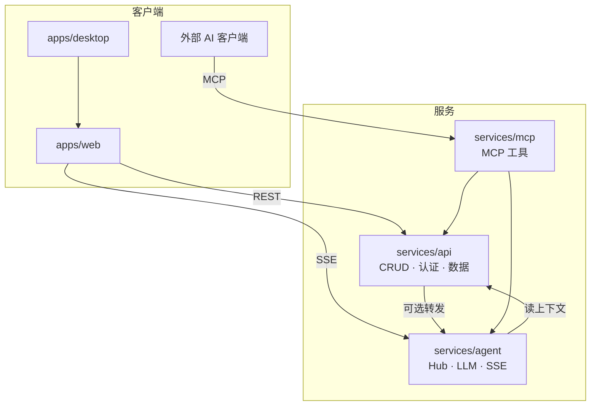

# RepoPilot 系统架构总览

> 版本: 2026-07-05 | 状态: 现行有效
>
> 本文档描述 **运行时架构** 与 **仓库组织原则**。目录细节见 [`REPO_LAYOUT.md`](./REPO_LAYOUT.md)，路径对照见 [`PATH_MAPPING.md`](./PATH_MAPPING.md)。

---

## 1. 设计原则

RepoPilot 不是单体 CRUD 网站，而是 **多客户端 + 多后端服务** 平台：

| 原则 | 说明 |
|------|------|
| 进程分离 | Web、API、Agent、MCP 可独立启动与部署 |
| 数据主权 | 持久化与 JWT 归 **API 服务**；Agent 通过 API 或共享契约读上下文 |
| Mock 先行 | v1 UI 已在 `docs/design/v1/frontend/` 完成审查并迁入 `apps/web` |
| 共享契约 | 跨服务类型与 API 形状归 `packages/contracts`、`packages/types`、`packages/py-shared` |

---

## 2. 目标运行时



**当前现状：** Multi-Agent 运行时已落地在 `services/api/backend/`（与 API 同进程）：

| 模块 | 路径 | 职责 |
|------|------|------|
| Hub | `agents/hub.py` | 意图路由、Plan-and-Execute、多 Agent 编排 |
| ReAct | `agents/react.py` | 推理循环、工具调用、反问拦截 |
| Registry | `agents/registry.py` | Hub/Scout/Mentor/Navigator/Curator/Scribe/Atlas |
| LLM | `llm/provider.py` | LiteLLM BYOK 流式/非流式 |
| Memory | `memory/` | 短期/长期记忆、画像提案合并、上下文压缩 |
| Tools | `tools/builtin.py` | 项目/图谱/GitHub/笔记/反问/调度等工具 |

`services/agent`、`services/mcp` 仍为未来独立进程预留。对话入口统一走 Hub，前端不再手动选择 Agent。

---

## 3. 仓库三层

```
apps/        → 用户看见的（Web、Desktop）
services/    → 可部署的后端（api、agent、mcp）
packages/    → 无运行时共享库（types、ui、prompts、contracts…）
```

---

## 4. 文档与代码的对应关系

| 文档层 | 目录 | 职责 |
|--------|------|------|
| 产品 | `docs/product/` | 做什么（PRD > SPEC > MVP） |
| 架构 | `docs/architecture/` | 怎么组织（本文档、布局、路径对照） |
| 设计/Mock | `docs/design/v1/` | UI 原型 + Mock 前端实现流程 |
| 开发 | `docs/development/` | 怎么演化（路线图、流程、日志） |

**冲突处理：** 路径以 `PATH_MAPPING.md` 为准；产品行为以 PRD > SPEC > MVP 为准。

---

## 5. 演进路线

1. **现在：** `docs/design/v1/frontend` Mock 开发 + `services/api` 后端实现
2. **近期：** UI 审查通过 → 迁入 `apps/web` → 接 Real API
3. **中期：** Agent 拆至 `services/agent` 独立进程
4. **v1.4+：** `services/mcp` 对接外部 AI 生态
