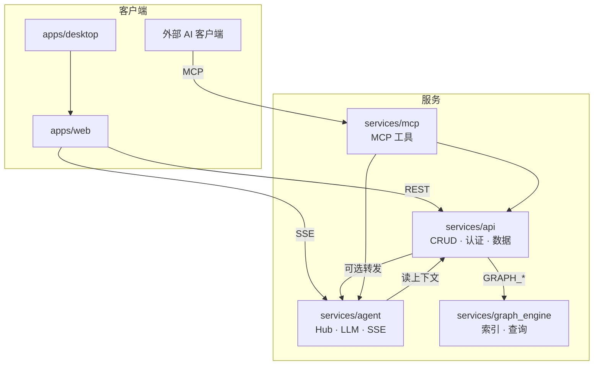

# Voyager 系统架构总览

> 版本: 2026-08-12 | 状态: 现行有效
>
> 本文档描述 **运行时架构** 与 **仓库组织原则**。目录细节见 [`REPO_LAYOUT.md`](./REPO_LAYOUT.md)，路径对照见 [`PATH_MAPPING.md`](./PATH_MAPPING.md)，实现进度见 [`../development/PROGRESS_REPORT.md`](../development/PROGRESS_REPORT.md)。

---

## 1. 设计原则

Voyager 不是单体 CRUD 网站，而是 **多客户端 + 多后端服务** 平台：

| 原则 | 说明 |
|------|------|
| 进程分离 | Web、API、Agent、Graph Engine、MCP 可独立启动与部署 |
| 数据主权 | 持久化与 JWT 归 **API 服务**；Agent 通过 API 或共享契约读上下文 |
| Mock 先行 | v1 UI 已在 `docs/design/v1/frontend/` 完成并迁入 `apps/web`；当前 `apps/web` 已可对接 `services/api` 真实后端 |
| 共享契约 | **`packages/types` 已落地**：`scripts/export_openapi.py` 导出 `packages/contracts/openapi.json`，`apps/web` 经 `types` 引用（76 个别名零 drift）；`ui`/`prompts`/`py-shared`/`config` 仍为占位 |

---

## 2. 目标运行时


```mermaid
flowchart TB
    subgraph clients["客户端"]
        WEB["apps/web"]
        DESK["apps/desktop"]
        EXT["外部 AI 客户端"]
    end

    subgraph services["服务"]
        API["services/api<br/>CRUD · 认证 · 数据"]
        AGENT["services/agent<br/>Hub · LLM · SSE"]
        GRAPH["services/graph_engine<br/>索引 · 查询"]
        MCP["services/mcp<br/>MCP 工具"]
    end

    WEB -->|REST| API
    WEB -->|SSE| AGENT
    DESK --> WEB
    API -->|可选转发| AGENT
    API -->|"GRAPH_*"| GRAPH
    AGENT -->|读上下文| API
    EXT -->|MCP| MCP
    MCP --> API
    MCP --> AGENT
```

**当前现状：** Multi-Agent 运行时**权威实现已迁入 `services/agent/agent_core/`**，api 直接 import（2026-08-12 移除 `api_backend` 兼容 shim）。默认与 API 同进程，也可经 `AGENT_BASE_URL` + `agent_runtime`（:19877）独立部署：

| 模块 | 路径（权威） | 职责 |
|------|------|------|
| Hub | `services/agent/agent_core/agents/hub.py` | 意图路由、Plan-and-Execute、多 Agent 编排 |
| ReAct | `services/agent/agent_core/agents/react.py` | 推理循环、工具调用、反问拦截 |
| Registry | `services/agent/agent_core/agents/registry.py` | Hub/Scout/Mentor/Navigator/Curator/Scribe/Atlas |
| LLM | `services/agent/agent_core/llm/provider.py` | LiteLLM BYOK 流式/非流式 |
| Memory | `services/agent/agent_core/memory/` | 短期/长期记忆、画像提案合并、上下文压缩 |
| Tools | `services/agent/agent_core/tools/builtin.py` | 24 个内置工具：项目/图谱/GitHub/笔记落库/分类标签/进度/导入/反问/调度等 |

`services/mcp` 仍为未来独立进程预留。对话入口统一走 Hub；专家可被 Hub 派发，并支持写工具真实落库（笔记/分类/标签/进度/导入）。工具层经 `api_backend/ports/` 协议（Project/Note/Category/Tag/Session/Graph Port）访问 ORM。

---

## 3. 仓库三层

```
apps/        → 用户看见的（Web、Desktop）
services/    → 可部署的后端（api、agent、graph_engine、mcp）
packages/    → 无运行时共享库（types、ui、prompts、contracts…）
```

---

## 4. 文档与代码的对应关系

| 文档层 | 目录 | 职责 |
|--------|------|------|
| 产品 | `docs/product/` | 做什么（PRD > SPEC > MVP） |
| 架构 | `docs/architecture/` | 怎么组织（本文档、布局、路径对照） |
| 设计/Mock | `docs/design/v1/` | UI 原型 + Mock 前端实现流程 |
| 开发 | `docs/development/` | 怎么演化（路线图、流程、日志） |

**冲突处理：** 路径以 `PATH_MAPPING.md` 为准；产品行为以 PRD > SPEC > MVP 为准。

---

## 5. 演进路线

1. **现在：** `apps/web` + `services/api` + `services/agent/agent_core` + `services/graph_engine`；`docs/design/v1/frontend` 为设计归档
2. **近期：** 产品文档（PRD/SPEC）与代码对齐（对照矩阵）、Agent 部署级独立进程（`agent_runtime` 已就绪，需解除 `agent_core ↔ api_backend` 循环依赖）、E2E/覆盖率补齐
3. **中期：** `packages/py-shared` 落地共享 Python 契约、CI 建立
4. **v1.4+：** `services/mcp` 对接外部 AI 生态
