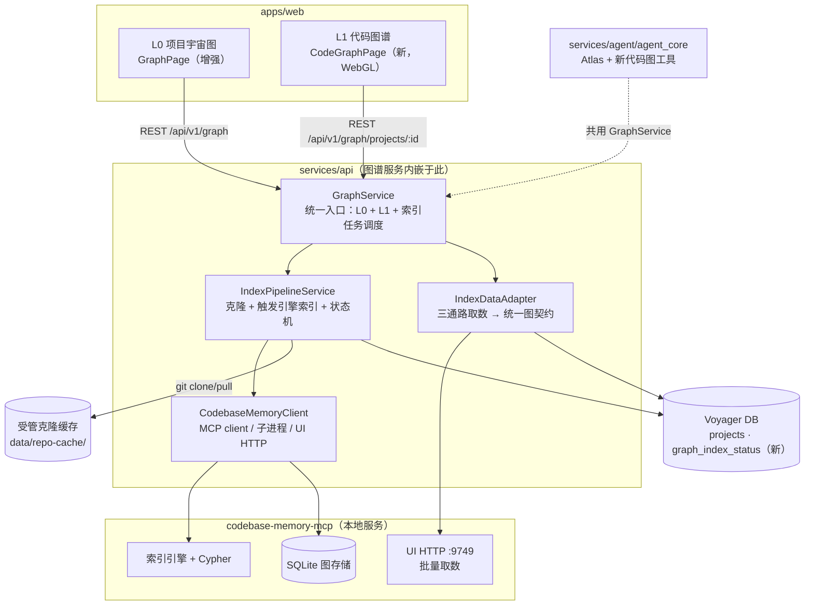

# Voyager 两级图谱 —— 详细设计

> 版本： 2026-08-09 | 状态： **详细设计（待评审 → 升级 SPEC）**
>
> 本文是方向文档 `README.md` 的细化，回答"怎么设计"。索引流水线的方案论证见 `INDEX_PIPELINE.md`（本文引用其结论，不重复论证）。
>
> 本文基于对 codebase-memory-mcp 真实输出（Voyager 自身索引：7136 节点/22125 边/15 节点类型/20 边类型）、Voyager 现有代码、GitHub API 能力的核对。关键事实标【验证】；待 SPEC 定量项标【SPEC】。

---

## 目录

1. [设计目标与约束](#1-设计目标与约束)
2. [目标架构](#2-目标架构)
3. [数据模型与契约](#3-数据模型与契约)
4. [索引流水线（云端→图谱）](#4-索引流水线云端图谱)
5. [取数层（三通路）](#5-取数层三通路)
6. [渲染层](#6-渲染层)
7. [Agent 融合](#7-agent-融合)
8. [状态机与异步任务](#8-状态机与异步任务)
9. [API 设计](#9-api-设计)
10. [前端设计](#10-前端设计)
11. [L0 增强](#11-l0-增强)
12. [安全与边界](#12-安全与边界)
13. [分阶段实施](#13-分阶段实施)
14. [验收标准](#14-验收标准)
15. [开放问题](#15-开放问题)

---

## 1. 设计目标与约束

### 1.1 目标

- **两级图谱**：L0 项目宇宙图（项目间关系）+ L1 项目代码图谱（项目内结构），共用一套渲染与图契约。
- **云端项目可索引**：GitHub URL 项目能进入 L1（核心难题，方案见 `INDEX_PIPELINE.md`）。
- **Agent 可感知代码图**：Atlas 等专家获得代码级查询能力，与前端共用同一图谱服务。
- **不重造引擎**：索引与图存储复用 codebase-memory-mcp（MIT），Voyager 只建"流水线 + 取数 + 渲染 + Agent 工具"。

### 1.2 硬约束（已核实）

| 约束 | 来源 | 影响 |
|------|------|------|
| 引擎只索引本地路径 | 参考项目文档 | Voyager 必须自己 clone |
| `GRAPH_ALLOWED_ROOT` 锁定索引根 | 参考项目文档 | 缓存目录须落在该根下 |
| 引擎为 MCP stdio 服务 | 参考项目文档 | 集成走 MCP client/子进程 |
| Voyager 当前无落盘/无任务基建 | `project_service.py:179`、无 celery/APScheduler | 需新建流水线与异步任务 |
| 现有 L0 契约不可破坏 | `api/graph.py`、`types.ts:98` | L0 端点扩展不破坏 |
| 本地单机部署 | README（纯本地、安装即用） | 无多租户；并发先串行 |

---

## 2. 目标架构



**进程归属**：图谱服务先内嵌于 `services/api`（与现有 `graph_service.py` 同进程，本机运行）；`services/mcp` 占位进程未来可承接对本机其他 AI 客户端的 MCP 暴露，但**图谱服务本身不依赖 mcp 进程落地**（方向 README D2）。

**关键边界**：对上层（前端/Agent），`GraphService` 是唯一入口；引擎、克隆、取数通路都是其内部实现，可替换。

---

## 3. 数据模型与契约

### 3.1 引擎原生 schema（实测，L1 数据基础）

【验证：对 Voyager 自身索引 `get_graph_schema` + `get_architecture`】

- **节点（15 类）**：Project(1) / Branch(1) / Folder(149) / File(673) / Module(668) / Section(2144) / Function(1669) / Method(567) / Class(207) / Interface(241) / Type(133) / Variable(581) / Route(79) / Decorator(16) / EnvVar(7)。
- **边（20 类）**：DEFINES(8276) / CALLS(4616) / USAGE(3803) / IMPORTS(2079) / CONTAINS_FILE(673) / DEFINES_METHOD(562) / TESTS(474) / WRITES(416) / SIMILAR_TO(313) / DECORATES(305) / SEMANTICALLY_RELATED(237) / CONTAINS_FOLDER(140) / HANDLES(93) / FILE_CHANGES_WITH(92) / CONFIGURES(19) / INHERITS(18) / IMPLEMENTS(5) / RAISES(2) / HAS_BRANCH(1) / **HTTP_CALLS(1)**。
- **节点携带属性**：复杂度（cyclomatic/cognitive/loop_depth）、入口点、导出、测试标记、路由 method/path、签名、参数等——是死代码判定、热点、调用链的数据基础。
- **架构视图数据**：`get_architecture` 额外产出 packages / entry_points / routes / hotspots（fan_in 排序）/ boundaries（跨包调用）/ layers（api/core/entry/internal 分层）/ **clusters（Leiden 社区聚类，带 cohesion 与 top_nodes）**【验证：Voyager 产出 12 个 cluster，如 `apps`(244 成员,cohesion 0.94)、`services`(254 成员)】。

> 这些 cluster/boundary/layer 即用户所需"层级关系"的现成来源——引擎已算好，无需 Voyager 自研依赖层级分析。

### 3.2 Voyager 统一图契约（L0/L1 共用）

L0 现有契约（`types.ts:98`）只有 `{nodes,edges}`，节点字段面向项目（stars/language/category）。L1 节点字段面向代码（kind/qualified_name/file/lines/complexity）。两者抽象为统一契约，新增 `level` 与 `kind`：

```
GraphData { nodes: GraphNode[]; edges: GraphEdge[]; stats: GraphStats }
GraphNode { id, name, kind, level, ...动态属性 }
GraphEdge { source, target, relation, weight?, reasons? }
```

- `level: "project" | "code"`，`kind`：L0 为 `"project"`；L1 为引擎节点类型（Function/Class/...）。
- 边 `relation`：L0 为 `similarity`/`cross_http`/`cross_async`/`shared_dep`；L1 为引擎边类型（CALLS/IMPORTS/...）。
- 契约类型进 `packages/types`（沿用 OpenAPI 生成链路，`scripts/export_openapi.py`）。
- **L0 旧端点 `GET /api/v1/graph/` 响应结构保持兼容**（只增字段不改语义），前端 `GraphNode` 旧字段保留。

### 3.3 Voyager 侧持久化（新增）

回应方向 README D3 / `graph_cache` 历史：

```
graph_index_status
  project_id        FK→projects
  engine_project    str        # 引擎内 project 名（映射）
  local_path        str        # 缓存目录绝对路径
  head_sha          str?       # 克隆的 commit
  branch            str?
  status            enum       # NONE/QUEUED/CLONING/INDEXING/READY/STALE/CLONE_FAILED/INDEX_FAILED
  index_mode        enum       # fast/moderate/full
  node_count        int?
  edge_count        int?
  indexed_at        datetime?
  error             text?
  unique(project_id)
```

- L0 相似度仍实时计算（项目数小），不持久化。
- 跨仓边（L0 新边类型）来自引擎 `cross-repo-intelligence`，随索引刷新后重算。

---

## 4. 索引流水线（云端→图谱）

方案论证见 `INDEX_PIPELINE.md`，此处只列设计与衔接。

### 4.1 流水线步骤

```
触发(用户/Agent)
  → 1. URL 校验（github.com，复用 schemas/project.py:49）
  → 2. 入队 graph_index_status.status=QUEUED
  → 3. 克隆：git clone --depth 1 --filter=blob:none --single-branch
         到 data/repo-cache/<owner>-<repo>-<sha7>/
         私仓用 github_client.py 的 token
  → 4. 触发引擎索引：CodebaseMemoryClient.index_repository(
         repo_path=本地路径, mode=fast|moderate|full,
         name=engine_project)
  → 5. 状态就绪 READY，回填 node_count/edge_count/indexed_at
  → 6. 可查询/可渲染
```

### 4.2 与现有代码的衔接

| 现有 | 复用方式 |
|------|---------|
| `import_repos`（`project_service.py:179`） | **不改**。导入只入库元数据；索引是独立动作，由用户/Agent 显式触发 |
| `github_client.py` token 机制 | 复用：私仓 clone 的 `Authorization: Bearer` |
| `core/security.py` Fernet | 复用：token 加密存储 |
| `schemas/project.py` URL 校验 | 复用：clone 前再校验 |
| SSE 基建（`agent_service.py`） | 复用：索引状态推送 |
| `services/mcp` 占位 | **本期不动**；图谱服务内嵌 `services/api`，mcp 进程后置 |

### 4.3 不做的事

- 不在导入时自动索引（分钟级，重操作）。
- 不接受用户传任意本地路径（防路径穿越，本期）。
- 不执行被索引项目代码（引擎只静态解析）。

---

## 5. 取数层（三通路）

化解方向 README R1。三通路分工（`INDEX_PIPELINE.md` §4 决策）：

| 通路 | 消费者 | 场景 | 实现 |
|------|--------|------|------|
| **引擎 UI HTTP（:9749）** | 前端渲染 | 批量取点边，服务端节点预算/过滤/聚类 | `IndexDataAdapter` 调 UISRV |
| **MCP 工具** | Agent | search_graph/trace_path/get_architecture/get_code_snippet | `CodebaseMemoryClient` MCP client |
| **直读 SQLite** | 降级 | HTTP 不可用时全量导出 | 锁版本，只读，WAL |

### 5.1 渲染取数（HTTP 通路）

- 引擎 UI HTTP 已存在（`--ui=true --port=9749`），有 `POST /api/index` 等【验证】。
- `IndexDataAdapter` 将引擎响应映射为 Voyager 统一图契约（§3.2），前端不感知引擎 schema。
- 服务端预算：大图按节点预算分页（参考项目 UI 有"node budget 5000"机制），前端拉取预算内的子图。

### 5.2 Agent 取数（MCP 通路）

Agent 工具直接映射引擎 MCP 工具，经 `GraphService` 调用（单一入口）：

| Voyager 工具 | 引擎工具 | 用途 |
|---------------|---------|------|
| `search_code_graph` | `search_graph` | BM25+语义找符号 |
| `trace_calls` | `trace_path` | caller/callee/数据流 |
| `get_project_architecture` | `get_architecture` | packages/clusters/layers/hotspots |
| `get_code_snippet` | `get_code_snippet` | 取符号源码 |

### 5.3 跨仓边取数

- 引擎 `index_repository(mode="cross-repo-intelligence", target_projects=[...])` 产出 CROSS_HTTP_CALLS/CROSS_ASYNC_CALLS/CROSS_CHANNEL【验证：工具定义含此模式】。
- L0 增强阶段：对已索引项目集合跑一次跨仓模式，结果作为 L0 的 `cross_http` 等边写入/缓存。

---

## 6. 渲染层

### 6.1 选型决策（方向 README D4 细化）

- **L1 必须 WebGL**：D3 SVG（现有 `ForceGraph.tsx`）在数百节点内流畅，L1 规模（实测起算 7k 节点）必然卡死。
- **候选**：sigma.js（2D WebGL，graphology，生态成熟）/ Cosmograph（GPU 力导，十万级）/ Three.js 自研（3D，成本最高）。
- **决策**：Phase 0 spike 用真实 Voyager 索引数据（7k+ 节点）对 sigma.js 与 Cosmograph 实测，按"帧率/内存/交互/维护性"选型【SPEC 拍板】。
- **长期**：L0/L1 统一同一渲染引擎（L0 节点少，迁移无压力），交互一致、维护一份。

### 6.2 视觉与交互

- 遵循 Voyager 现有设计体系（深色、玻璃拟态、分类色板），**不引入参考项目 3D/bloom 风格**。
- L1 交互对齐参考项目功能清单（方向 README §3 借鉴表）：节点类型过滤、边类型过滤、搜索定位居中、目录树联动、节点预算提示、标签开关、调用链逐层展开、死代码标记、聚类着色视图、节点详情（签名/位置/度数/复杂度）。
- 导航：L0 节点双击/详情按钮 → L1；L1 面包屑返回 L0。

### 6.3 性能目标【SPEC 定量】

- 单项目 ≥ 1 万节点可用渲染与交互（帧率阈值 SPEC 定）。
- 节点预算超限时服务端分页 + 提示（参考项目"node budget"模式）。
- 首屏渲染：节点预算内子图 < 2s（参考 L0 现有 G6-07 验收基线）。

---

## 7. Agent 融合

### 7.1 Atlas 升级（核心）

当前 Atlas（`registry.py:413`，tools 仅 `query_knowledge_graph` 等 5 个，项目级相似度）升级为代码图谱向导：

```
atlas.tools += [
  "search_code_graph",      # 代码符号检索
  "trace_calls",            # 调用链/数据流
  "get_project_architecture",  # packages/clusters/layers
  "get_code_snippet",       # 取源码
  "trigger_code_index",     # 触发索引流水线（新）
]
```

- Atlas 的 soul（`registry.py:124`）"图谱向导"语义天然适配代码图，扩展其 core prompt 到代码级。
- 工具 `allowed_agents` 含 `atlas`（沿用现有 `builtin.py` 模式）。

### 7.2 触发与可见性

- 用户对话"分析这个项目调用关系" → Hub 调度 Atlas（`registry.py:203` 意图路由"图谱→atlas"）→ Atlas 查 `graph_index_status`：
  - READY → 直接 `get_project_architecture`/`trace_calls` 解读。
  - NONE/STALE → 调 `trigger_code_index`（或经 `ask_user` 授权）→ 流水线跑 → 就绪后查询。
- 状态机对 Agent 可见（`trigger_code_index` 返回 status）。
- Scout（速览）可用 `fast` 索引 + `get_architecture` 给"30 秒结构速览"，补强当前仅 README 的速览。

### 7.3 单一入口原则

Agent 工具与前端渲染**共用 `GraphService`**（方向 README D2）：Agent 工具经 `GraphService` 调取数层，前端经 `GraphService` 调同一取数层。引擎是内部实现，Agent 工具不直连引擎。

---

## 8. 状态机与异步任务

状态机定义见 `INDEX_PIPELINE.md` §6。设计与衔接：

### 8.1 状态枚举

```
NONE → QUEUED → CLONING → INDEXING → READY
                 ↓失败        ↓失败
           CLONE_FAILED    INDEX_FAILED  （可重试）
READY → (远端新提交) → STALE → (更新) → CLONING(增量) → INDEXING → READY
```

### 8.2 异步执行

- Voyager 当前无 celery/APScheduler【验证：grep 无结果】。
- 本期方案：`asyncio.create_task`（进程内异步）+ DB 状态持久化 + 前端轮询/SSE 推送。
- 并发：本地单用户先**串行**（全局 1 个索引槽），后续按资源评估放开。
- 进程重启恢复：启动时扫 `graph_index_status` 中 `CLONING/INDEXING` 状态的任务标记为 `STALE` 或 `FAILED`（中途断电不续跑，用户重试）。

### 8.3 增量更新

- `git fetch --depth 1 && git reset --hard origin/<branch>` 增量拉代码 → 引擎重索引。
- 引擎自带 watcher 能力【验证：文档提及 daemon watchers】，接入方式 Phase 1 定（自动 watch vs 手动触发）。

---

## 9. API 设计

路由前缀沿用 `/api/v1/graph`（`api/graph.py` 现有），扩展 L1 子命名空间。**L0 端点保持兼容**。

### 9.1 L0（扩展不破坏）

| 方法 | 路径 | 说明 |
|------|------|------|
| GET | `/graph/` | 现有，相似度图（响应增字段不破坏） |
| GET | `/graph/cross-edges` | 新：跨仓边（cross-repo-intelligence 产出） |

### 9.2 L1（新增）

| 方法 | 路径 | 说明 |
|------|------|------|
| GET | `/graph/projects/:id` | L1 图数据（经取数层，带节点预算/过滤参数） |
| GET | `/graph/projects/:id/status` | 索引状态 |
| POST | `/graph/projects/:id/index` | 触发索引（body: mode） |
| POST | `/graph/projects/:id/refresh` | 增量更新 |
| DELETE | `/graph/projects/:id/index` | 删除索引与缓存 |
| GET | `/graph/projects/:id/architecture` | packages/clusters/layers/hotspots |
| POST | `/graph/projects/:id/trace` | 调用链（body: symbol, direction, depth） |
| POST | `/graph/projects/:id/search` | 符号检索（body: query, label?, limit?） |

- 所有端点经现有 `get_current_user` 鉴权（`api/deps.py`）+ 项目归属校验（`projects.user_id`）。
- 契约经 `packages/types` OpenAPI 生成。

---

## 10. 前端设计

### 10.1 路由与页面

| 路由 | 页面 | 状态 |
|------|------|------|
| `/graph` | L0（现有 `GraphPage.tsx`） | 增强 |
| `/graph/projects/:id`（或 `/projects/:id/graph`，SPEC 定） | L1（新 `CodeGraphPage.tsx`） | 新建 |

### 10.2 L1 页面结构

```
CodeGraphPage
├── CodeGraphControls      # 节点/边类型过滤、搜索、模式切换(结构/聚类/调用链)
├── CodeGraphCanvas        # WebGL 渲染（选型后）
├── DirectoryTree          # 目录树联动（左/可折叠）
├── NodeDetailPanel        # 符号详情：签名/位置/度数/复杂度/源码片段
├── IndexStatusBar         # 索引状态机四态 + 触发/重试/更新
└── BreadCrumb             # L0 ← L1 返回
```

### 10.3 状态管理

- 复用 Zustand（现有 `graphStore` 模式），新增 `codeGraphStore`：`indexStatus`、`nodeTypeFilter`、`edgeTypeFilter`、`viewMode`、`selectedSymbol`。
- 复用 React Query（现有 `useGraph` hook 模式），新增 `useCodeGraph`/`useIndexStatus`。

### 10.4 渲染迁移

- L0 暂留 D3（节点少）；L1 用新 WebGL 库。
- 长期：L0 迁移到 L1 同一库（§6.1），作为后置阶段。

---

## 11. L0 增强

### 11.1 边类型扩展

| 边类型 | 来源 | 说明 |
|--------|------|------|
| `similarity` | 现有 `graph_service.py` | 保留，实时计算 |
| `cross_http` | 引擎 cross-repo-intelligence | A 项目 HTTP 调用 B 项目 Route【验证：引擎有 HTTP_CALLS 边与 Route 节点】 |
| `cross_async` | 同上 | 异步消息调用 |
| `shared_dep` | 候选 | 共享依赖（后置） |

### 11.2 交互

- 边类型筛选与视觉区分（颜色/线型）。
- 边可解释：点边显示"为什么"（相似度 reasons / 调用位置）。
- 相似度算法升级（嵌入向量）为可选后置项。

---

## 12. 安全与边界

| 项 | 措施 | 现状 |
|----|------|------|
| URL 来源 | 仅 github.com | ✅ `schemas/project.py:49` |
| 私仓凭据 | token + Fernet | ✅ `core/security.py:99` |
| 索引根 | 缓存目录落 `GRAPH_ALLOWED_ROOT` 下 | ⚠️ 新增对齐配置 |
| 路径穿越 | 路径由 Voyager 计算，拒用户传参 | ⚠️ 新增 |
| 不可信执行 | 索引只静态解析 | ✅ 引擎特性 |
| 磁盘耗尽 | 配额 + LRU | ⚠️ 新增【SPEC 阈值】 |
| 多用户隔离 | 纯本地单机，单用户独占，无需跨用户隔离 | ✅ 部署前提已免除 |

---

## 13. 分阶段实施

> 细化方向 README §6 路线图，标注与代码的衔接点。

### Phase 0 —— 技术验证（不写产品代码）
- spike：5k/20k 节点渲染库选型（sigma.js vs Cosmograph）。
- spike：引擎 UI HTTP 9749 取数带宽实测。
- spike：cross-repo-intelligence 在两个有 HTTP 调用关系的仓上产出质量。
- spike：Windows 浅克隆 + 长路径 + 符号链接实测。
- 产出：四份 spike 记录入 `docs/development/`；D4/取数通路定稿。

### Phase 1 —— L1 最小闭环
- `graph_index_status` 表 + Alembic 迁移。
- `IndexPipelineService`：浅克隆 + 触发引擎索引 + 状态机（串行）。
- `CodebaseMemoryClient`：MCP/子进程驱动 + UI HTTP 取数。
- `IndexDataAdapter`：HTTP 通路 → 统一契约。
- L1 页面：选定渲染库渲染点边 + 节点详情 + 四态状态栏 + L0→L1 导航。
- 验收：1k+ 节点真实项目全流程可用，状态刷新不丢。

### Phase 2 —— L1 完整体验
- 节点/边类型过滤、搜索、目录树、调用链逐层展开、死代码、聚类着色、节点预算。
- 私仓凭据、增量更新（STALE→更新）。
- 验收：对照参考项目功能清单逐项核对。

### Phase 3 —— L0 增强 + 渲染统一
- 跨仓边（cross-repo-intelligence）→ L0 `cross_http`/`cross_async` 边。
- 边类型筛选与可解释。
- L0 渲染迁移到 L1 同库（若 spike 支持渐进迁移）。

### Phase 4 —— Agent 融合
- Atlas 工具升级（`search_code_graph`/`trace_calls`/`get_project_architecture`/`trigger_code_index`）。
- Scout fast 索引速览。
- L1↔笔记联动（调用链存笔记）。
- `services/mcp` 进程拆分评估。

---

## 14. 验收标准

- **两级闭环**：L0 任意项目可进入 L1 并返回，状态连贯。
- **云端可索引**：GitHub URL 项目经触发后进入 READY，可渲染。
- **规模**：L1 ≥ 1 万节点可用渲染（帧率 SPEC 定）。
- **关系可解释**：L0/L1 每条边可回答"为什么"。
- **状态可靠**：四态在刷新/重启后不丢不错乱；中断任务可重试。
- **不回退**：L0 现有契约与行为兼容；现有 `/graph` 与 `query_knowledge_graph` 工具行为不破坏。
- **可替换**：引擎与渲染库被适配层/契约隔离，替换不改动对方。
- **Agent 可用**：Atlas 能回答"X 被谁调用"并给图谱依据。

---

## 15. 开放问题

1. 引擎 UI HTTP 9749 的多项目隔离方式（单机多项目区分索引实例）【SPEC】。
2. `GRAPH_ALLOWED_ROOT` 与 `data/repo-cache/` 对齐策略【SPEC】。
3. 缓存配额阈值与 LRU 触发条件【SPEC】。
4. 引擎版本锁定与升级 checklist（直读 SQLite 降级路径依赖版本）【SPEC】。
5. 增量更新策略：全量重建 vs 引擎 watcher 增量【Phase 1 定】。
6. L1 路由归属：`/graph/projects/:id` vs `/projects/:id/graph`【SPEC】。
7. 渲染库最终选型【Phase 0 spike 拍板】。
8. 相似度算法是否升级嵌入向量【后置评估】。
