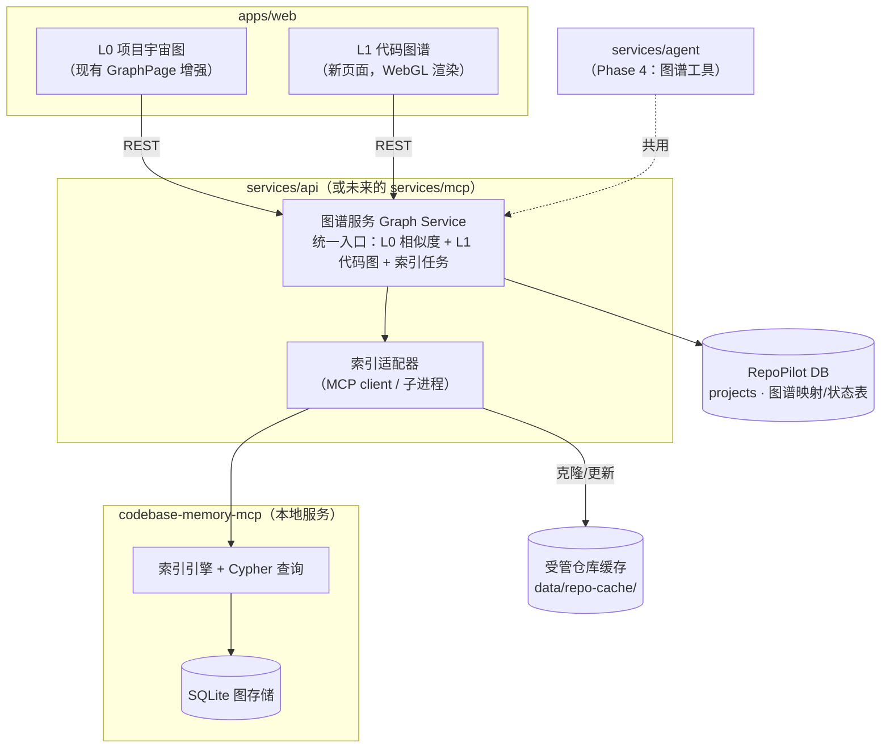

# RepoPilot 知识图谱 v2 —— 两级图谱总体开发文档

> 版本： 2026-08-09 | 状态： **方向性文档（草案，待评审）**
>
> **2026-08-12 更新**：C 索引引擎在 [`services/graph_engine/graph_engine_core`](../../../services/graph_engine/graph_engine_core)（MIT 源码迁自 codebase-memory-mcp），默认 sidecar `127.0.0.1:9750`；Python 回退在 `graph_engine_runtime/`。下文中「外挂 codebase-memory-mcp / :9749」或路径 `services/graph_engine/c` 视为历史方案。
>
> 本文档定义 RepoPilot 图谱子系统的**演进方向与关键决策**，是后续 PRD/SPEC 修订与开发实施的输入。
> 本文档**不包含**接口定义、字段设计、组件实现等细节；落地前须按 `docs/README.md` §1 的权威性规则，将本文档的结论升级为 `product/` 层文档（PRD/SPEC）的修订。
>
> 阅读对象：维护者、接手开发的工程师与 Agent。

## 本目录文档索引

| 文档 | 定位 | 详略 |
|------|------|------|
| `README.md`（本文档） | 方向与关键决策 | 方向级 |
| [`DETAILED_DESIGN.md`](./DETAILED_DESIGN.md) | 整体详细设计（架构/数据/取数/渲染/Agent/状态机/API/前端） | 详细级 |
| [`INDEX_PIPELINE.md`](./INDEX_PIPELINE.md) | 云端项目索引流水线方案分析与敲定（核心难题） | 专题论证 |

阅读顺序：本文档（方向）→ `INDEX_PIPELINE.md`（核心难题如何解）→ `DETAILED_DESIGN.md`（整体怎么设计）。

---

## 1. 背景与目标

### 1.1 现状（已核对代码）

RepoPilot 当前已有**一层**图谱：项目级相似度图。

| 层 | 现状 | 关键位置 |
|----|------|---------|
| 后端 | `GET /api/v1/graph/`：对当前用户的全部 Project 做 TF-IDF + 语言/分类/名称重叠的 O(n²) 相似度计算，**实时计算、无持久化** | `services/api/api_backend/api/graph.py`、`services/api/api_backend/services/graph_service.py` |
| 前端 | `/graph` 路由：D3 SVG 力导向图；单击出详情抽屉、双击跳 `/projects/:id`；有搜索高亮、相似度滑块、分类筛选、Mock/Real 双轨 | `apps/web/src/pages/GraphPage.tsx`、`apps/web/src/components/graph/{ForceGraph,GraphControls,GraphGuidePanel}.tsx` |
| 数据 | Project 仅记录 GitHub URL / 语言 / 分类 / 笔记等元信息，**无本地代码路径、无任何代码级结构数据** | `services/api/api_backend/models/project.py` |
| 设计文档 | v1 阶段文档 `docs/design/v1/process/06-GRAPH.md`（仅覆盖项目相似度图） | — |
| 进程占位 | `services/mcp` 为占位进程；SPEC 曾规划 `graph_cache` 表，后被"实时计算"替代 | `docs/development/PROGRESS_REPORT.md` §4.1 |

**缺口：** 用户进入某个项目后，看不到该项目**内部**的代码结构（文件/函数/类/调用/路由），项目之间的边也只有"文本相似"一种语义。

### 1.2 参考项目：codebase-memory-mcp

参考项目 [DeusData/codebase-memory-mcp](https://github.com/DeusData/codebase-memory-mcp)（**MIT 许可**）为**单个仓库**构建代码知识图谱，其能力（与本任务相关的部分）：

- **索引**：单二进制（C + Tree-sitter，158 种语言语法 + 类 LSP 类型解析），多遍流水线产出节点（Project/Folder/File/Module/Class/Interface/Method/Function/Variable/Type/Route/Decorator/EnvVar/Section）与边（CALLS/IMPORTS/CONTAINS/HTTP_CALLS/DATA_FLOWS 等），持久化于本机 SQLite。
- **查询**：MCP stdio 服务，约 15 个工具（`index_repository`、`search_graph`（BM25+语义）、`query_graph`（Cypher）、`trace_path`（调用链/数据流）、`get_architecture`（含 Leiden 社区聚类）、`search_code` 等）。
- **跨仓能力（关键）**：`cross-repo-intelligence` 模式可跨项目匹配 Route/Channel，生成 **CROSS_HTTP_CALLS / CROSS_ASYNC_CALLS / CROSS_CHANNEL** 边——即"项目之间的关系"该引擎**原生支持**。
- **UI**：自带可选图形界面（节点类型过滤、死代码标记、目录树、节点预算、标签开关、聚类着色），即本任务发起时的参考截图。

> 本机已部署该服务（npm 全局 v0.9.0，moderate 模式索引过本仓库，3451 节点），集成可行性已被初步验证。

### 1.3 目标愿景：两级图谱

```
L0 项目宇宙图（Project Universe）          L1 项目代码图谱（Code Graph）
┌─────────────────────────────┐          ┌──────────────────────────────────┐
│  节点 = 项目                  │  双击/进入 │  节点 = 文件/类/函数/方法/路由/变量    │
│  边   = 语义相似 + 跨仓调用    │ ───────▶ │  边   = 调用/导入/包含/数据流/HTTP    │
│  （现在这层 + 跨仓关系增强）    │ ◀─────── │  （对齐参考项目能力）               │
└─────────────────────────────┘  返回/面包屑 └──────────────────────────────────┘
```

- **L0 回答的问题**："我收藏的这些项目彼此之间是什么关系？"（相似、互补、依赖、调用）
- **L1 回答的问题**："这个项目内部是怎么组织的？X 函数被谁调用？哪些代码是死的？"
- 两级共用一套图渲染与交互体系，导航上无缝钻取（drill-down / drill-up）。

### 1.4 非目标（本期不做）

- 不做多用户云端图谱服务。RepoPilot 是**纯本地单机应用，用户本机安装即用**：不发布云端、不考虑多用户隔离。本方案所有设计（clone 到本机、本机引擎索引、本机取数渲染）都基于此前提。
- 不重造索引引擎（Tree-sitter 解析、调用链解析直接复用参考项目，见 §4-D1）。
- 不照搬参考项目的 3D UI 与自带 Web 服务（我们自建渲染层，见 §4-D4）。
- 不在本期改变 Project 的导入主流程（GitHub URL 导入保持不变；本地落盘是图谱子系统内部的事，见 §4-D6）。
- 不做实时协同编辑、不做图谱的写操作（图谱为只读视图；图谱驱动的写操作仍走现有 Agent 工具层）。

---

## 2. 两级图谱模型

### 2.1 L0 项目宇宙图（增强现有层）

节点为用户导入的项目。边的语义从"仅相似"扩展为**多类型边**：

| 边类型 | 来源 | 说明 |
|--------|------|------|
| 语义相似 | 现有 `graph_service`（可后续升级为嵌入向量） | 文本/主题相似，现有能力保留 |
| 跨仓调用 | codebase-memory `cross-repo-intelligence` | A 项目的代码 HTTP/异步调用了 B 项目暴露的 Route/Channel——这是参考项目带来的**新关系维度** |
| 同作者/同组织、依赖关系 | GitHub 元数据 / 依赖清单 | 候选增强，优先级低 |

交互保持现有范式（力导向、筛选、详情抽屉），新增**边类型切换**与**进入 L1** 的入口。

### 2.2 L1 项目代码图谱（新建层）

进入单个项目后，渲染该项目内部的代码图谱，能力对齐参考项目：

- **节点类型**：File / Folder / Module / Class / Interface / Method / Function / Variable / Route 等，按类型着色与过滤。
- **边类型**：CONTAINS（目录包含）、IMPORTS、CALLS、HTTP_CALLS、DATA_FLOWS 等，支持按类型过滤。
- **浏览辅助**：目录树联动、搜索定位、节点详情（签名、位置、度数）、调用链追踪（caller/callee 展开）、死代码标记、社区聚类着色（架构分区视图）。
- **规模预期**：单项目数千至数万节点（参考项目对本仓库 moderate 索引即 3451 节点，full 模式 7136+），渲染与取数均须按此规模设计（§4-D3/D4）。

### 2.3 导航模型

- `/graph` → L0；`/graph/projects/:id`（或 `/projects/:id/graph`，路由归属在 SPEC 阶段定）→ L1。
- L0 节点双击/详情按钮 → L1；L1 提供面包屑/返回 L1→L0。
- L1 与现有 `/projects/:id` 详情页的关系：L1 是详情页的"图谱"维度入口，详情页保留 README/笔记/进度等职能，不互相替代。

### 2.4 统一图契约

两级图在前端共用一套 `GraphNode / GraphEdge / GraphStats` 抽象（节点带 `kind`、边带 `relation`），契约类型进 `packages/types`（沿用 OpenAPI 生成链路）。渲染层只面向该抽象，不感知"项目图"还是"代码图"——这是两级复用一套渲染引擎的前提。

---

## 3. 从参考项目借鉴什么、不借鉴什么

| 维度 | 借鉴 | 不借鉴 |
|------|------|--------|
| 索引 | 整体复用其索引引擎与 SQLite 图存储（MIT） | 不自研 Tree-sitter/LSP 解析 |
| 数据模型 | 节点/边类型划分、Cypher 查询、社区聚类、死代码判定 | 不照搬其 per-account daemon 模型 |
| 跨仓 | `cross-repo-intelligence` 的 CROSS_* 边 → L0 的新边类型 | — |
| UI 交互 | 节点预算（node budget）、类型过滤、目录树、标签开关、搜索居中 | 不用其 3D 视觉与 bloom 风格（与 RepoPilot 设计体系不符）；不嵌入其自带 Web UI（9749 端口服务，集成度与多项目隔离都不满足） |
| 集成 | 作为本地服务/库被 RepoPilot 调用 | 不让用户直接面对另一个产品的 UI/概念体系 |

---

## 4. 关键架构决策（方向级）

> 每条决策给出选项与**推荐方向**；最终拍板与细化在 SPEC 阶段完成。

### D1 索引引擎：复用 codebase-memory-mcp，不自研

- **选项 A（推荐）**：复用 codebase-memory-mcp（MIT，已在本机验证）。索引质量、语言覆盖、跨仓能力现成。
- 选项 B：自研轻量索引（Tree-sitter 直接集成）。可控但工程量以季度计，且调用链解析是深坑。
- 选项 C：接入其他商用/云服务。违背本地优先与 BYOK 原则。
- **理由**：索引是成熟问题，差异化价值在"两级联动 + 学习平台场景"，不在索引本身。
- **前提核查**：MIT 许可确认 ✅；但其 UI 资产包为独立分发的二进制包（许可未单独确认）——我们不使用该资产包，无影响。

### D2 集成方式：作为本地子服务接入，由图谱服务封装

- **选项 A（推荐）**：RepoPilot 后端（图谱服务）以 MCP client / 子进程方式驱动 codebase-memory-mcp，对外只暴露 RepoPilot 自己的 REST 契约。`services/mcp` 占位进程是其自然落点（或先在 `services/api` 内以模块形式落地，进程拆分后置）。
- 选项 B：前端直连 codebase-memory 的 HTTP UI 服务。跨域、认证、多项目隔离全部失控，否决。
- 选项 C：把其 SQLite 当数据库直读（只读）。取数效率高，但与其内部 schema 强耦合。**作为 D3 取数通路的备选手段保留，不作为集成主方式。**
- **方向**：对上层（前端/Agent）而言，"图谱服务"是唯一入口；codebase-memory 是实现细节，可替换。

### D3 图谱数据取数与存储：引擎存储为主，RepoPilot 侧做投影缓存

- 引擎侧：代码图本体存于 codebase-memory 的 SQLite（不复制一份真相）。
- RepoPilot 侧需要解决两个问题：
  1. **渲染取数**：前端渲染全图需要批量点边数据（数千~数万节点）。MCP 工具面向检索而非批量导出，须在 Phase 0 验证取数带宽（候选：Cypher 分页 / 直读 SQLite / 引擎批量导出能力）。这是**项目级技术风险点**。
  2. **映射与元数据**：`projects.id ↔ 引擎内 project 名 ↔ 索引状态（未索引/索引中/就绪/失败/过期）` 需要 RepoPilot 侧持久化（一张映射/状态表即可；这也回应了当初 `graph_cache` 表被实时计算替代的历史决策——v2 下持久化重新变得必要）。
- L0 相似度边维持实时计算（项目数少）；跨仓边来自引擎，随索引刷新。

### D4 渲染引擎：L1 必须上 WebGL，L0 可保留 D3，方向是统一

- 现状 D3 SVG 在数百节点内流畅；L1 规模（5k~50k 节点）SVG 必然卡顿。
- **推荐方向**：评估并选定一个 WebGL 图渲染库（候选：sigma.js（2D，生态成熟）、Cosmograph（GPU 力导，十万级）、自研 Three.js（3D，成本最高）），在 Phase 0 用真实索引数据做选型 spike。
- L0 节点规模小（数十~数百），可暂留 D3；但**长期方向是两级同一渲染引擎**（交互一致、维护一份）。选型时按 L1 要求选，L0 迁移作为后续阶段。
- 视觉：遵循 RepoPilot 现有设计体系（深色、玻璃拟态、分类色板），不引入参考项目的 3D 风格。

### D5 索引触发与更新：显式触发 + 异步任务 + 状态可见

- 项目导入后**不自动**索引（索引是分钟级重操作，且需先落盘代码）。
- 触发方式：用户在 L0/详情页显式"构建代码图谱"；后续可加"导入时勾选"。
- 执行为异步任务，前端可见状态机：`未索引 → 排队/索引中 → 就绪 / 失败（可重试）`；代码更新后标记`过期`并支持增量重建（引擎自带 watcher 能力，接入方式 Phase 1 定）。
- 并发与资源：限制同时索引数（本地单用户场景先串行）。

### D6 代码来源：按需克隆到受管缓存目录

- 现状 Project 只有 GitHub URL，没有本地代码。索引要求代码在本机。
- **推荐方向**：图谱服务维护受管缓存目录（如 `data/repo-cache/`），首次索引时浅克隆（shallow clone），后续 pull 更新；私有仓走现有 GitHub 集成凭据。
- 需要用户决策的点：磁盘占用策略（上限/清理）、是否允许用户指定"已有本地路径"免克隆（开发者场景友好，列为候选需求）。
- 安全：克隆来源 URL 必须经过现有 URL 校验；缓存目录不出用户机器。

### D7 与 Agent 体系的关系：图谱是 Atlas/Navigator 的感知升级

- 现有 Agent 工具层已有 Graph Port（项目级）。L1 落地后，代码级查询（search_graph / trace_path / get_architecture）应以**工具形式**注册进 `services/agent/agent_core/tools/`，让 Atlas（架构分析）/Navigator（代码导览）具备代码图感知。
- 方向：前端渲染与 Agent 工具**共用同一个图谱服务**（D2 的唯一入口原则），不各接一套。
- 本期范围：先做"人看的图"（Phase 1-3），Agent 工具化列为 Phase 4。

### 决策一览

| # | 决策 | 推荐方向 | 风险/前提 |
|---|------|---------|----------|
| D1 | 索引引擎 | 复用 codebase-memory-mcp | MIT ✅；版本升级策略待定 |
| D2 | 集成方式 | 后端封装为图谱服务，MCP/子进程驱动 | 不直读其库为主通路 |
| D3 | 取数与存储 | 引擎存图，RepoPilot 存映射+状态；渲染取数待验证 | **取数带宽是 Phase 0 必验项** |
| D4 | 渲染 | L1 选 WebGL 库；长期两级统一 | 需真实数据 spike 选型 |
| D5 | 索引触发 | 显式触发 + 异步 + 状态机 | 分钟级耗时需体验设计 |
| D6 | 代码来源 | 受管浅克隆缓存 | 磁盘策略、私仓凭据 |
| D7 | Agent 关系 | 共用图谱服务，后置工具化 | 不影响 Phase 1-3 |

---

## 5. 目标架构



**数据流（L1 首次进入）：** 用户在 L0 双击项目 → 前端请求 L1 图 → 图谱服务查状态：未索引则返回状态并触发异步索引（克隆 → 引擎索引 → 就绪）→ 前端轮询/通知 → 就绪后批量拉取点边 → WebGL 渲染。

**与现有架构的衔接：**
- 路由前缀沿用 `/api/v1/graph/...` 扩展（L0 现有端点保持兼容，L1 新增子命名空间）。
- 契约类型走 `packages/types` OpenAPI 生成链路（§2.4）。
- 进程归属：先在 `services/api` 内实现图谱服务；当 `services/mcp` 启动时可平移（适配器已隔离引擎细节）。

---

## 6. 分阶段路线图

> 每个阶段独立可验收、可交付；前一阶段的验收结论是后一阶段的输入。范围只写"做什么/不做什么/怎么验收"，不排期。

### Phase 0 — 技术验证（Spike，不写产品代码）

- **目标**：打掉两个最大不确定性。
- **事项**：
  1. 用 codebase-memory 索引 2~3 个不同规模的真实仓库，验证**批量取数带宽**（D3：Cypher 分页 / 直读 SQLite / 其他导出通路，各测一遍并记录数据）。
  2. 用 5k/20k 节点数据对候选渲染库（sigma.js / Cosmograph）做性能 spike（帧率、内存、交互流畅度），产出选型结论（D4 拍板）。
  3. 验证跨仓边（cross-repo-intelligence）在两个有真实 HTTP 调用关系的仓库上的产出质量（L0 新边类型的数据基础）。
- **验收**：三份 spike 结论记录（入 `docs/development/`）；D3/D4 决策定稿。
- **不做**：任何 UI 页面、任何 API 端点。

### Phase 1 — L1 最小闭环

- **目标**：一个项目能"索引 → 看到代码图"。
- **范围**：受管克隆（D6 最小版：仅公开仓浅克隆）；映射/状态表；索引异步任务（串行）；L1 页面（选定渲染库）：节点/边渲染、节点类型着色、节点详情（名称/类型/位置）、缩放平移；L0→L1 导航入口；空态/索引中/失败三态。
- **验收方向**：对一个 1000+ 节点的真实项目，从点击到看到图全流程可用；索引状态在 UI 可见；刷新后状态不丢。
- **不做**：过滤/搜索/聚类/死代码、私仓、增量更新、L0 改动。

### Phase 2 — L1 完整体验（对齐参考项目）

- **范围**：节点类型过滤、边类型过滤、搜索定位居中、目录树联动、节点预算与提示、标签开关、调用链追踪（caller/callee 逐层展开）、死代码标记、社区聚类着色视图、私仓凭据支持、索引过期与增量重建。
- **验收方向**：对照参考项目功能清单逐项核对（§3 借鉴列为验收基线）；5k 节点交互流畅（帧率目标在 SPEC 定量化）。
- **不做**：L0 增强、Agent 集成。

### Phase 3 — L0 增强

- **范围**：L0 边类型扩展（相似 + 跨仓调用，边类型筛选与视觉区分）；跨仓边来源说明（点边可见"为什么连"）；L0 渲染引擎向 L1 选型统一（若 spike 结论支持）；相似度算法升级评估（嵌入向量，可选）。
- **验收方向**：两个有真实调用关系的项目在 L0 上出现跨仓边且可解释；旧相似度行为不回退。

### Phase 4 — 融合与 Agent 集成

- **范围**：代码图工具注册进 agent_core（Atlas/Navigator 感知升级，D7）；L1 与项目详情页/笔记的联动（如"把这段调用链存为笔记"）；L0/L1 统一导航打磨；`services/mcp` 进程拆分评估。
- **验收方向**：Agent 能回答"这个项目的 X 被谁调用"并给出图谱依据；两级图导航无断点。

### 路线图依赖

```
Phase 0 (spike)
   ├─▶ Phase 1 (L1 最小闭环) ─▶ Phase 2 (L1 完整) ─┐
   └─▶ Phase 3 (L0 增强，可与 1/2 并行启动) ───────┴─▶ Phase 4 (融合 + Agent)
```

---

## 7. 风险与开放问题

| # | 风险/问题 | 影响 | 应对方向 |
|---|----------|------|---------|
| R1 | **渲染取数带宽**：MCP 工具非批量导出设计，数万节点全量拉取可能慢/不可行 | L1 可行性 | Phase 0 必验；备选直读 SQLite（只读、版本锁定） |
| R2 | 引擎版本升级：npm 包更新可能改 schema/行为 | 稳定性 | 适配器层隔离；锁定版本 + 升级 checklist |
| R3 | 索引耗时（分钟级）与大仓库内存峰值 | 体验 | 异步+状态机（D5）；大仓库降档索引模式（fast/moderate） |
| R4 | 磁盘占用（克隆缓存 + 图存储）随项目数增长 | 本地部署 | 缓存上限与清理策略（SPEC 定） |
| R5 | 私有仓认证与 URL 安全 | 安全 | 复用现有 GitHub 凭据与 URL 校验；缓存目录本机不外传 |
| R6 | 引擎为单机模型（per-machine SQLite/stdio） | 隔离 | 纯本地单机，单用户独占本机引擎，无多租户问题；`projects.user_id` 维度保留但无需做跨用户隔离 |
| R7 | Windows 路径/进程管理（引擎子进程生命周期） | 本地运行 | Phase 1 在 Windows 实测；纳入 dev.ps1 生命周期 |
| R8 | 与 openwiki 的概念重叠（都有"仓库结构理解"产物） | 定位清晰 | openwiki 是文档证据索引，图谱是结构关系视图；文档中互相引用，不合并 |
| R9 | 前端渲染库选型的社区活跃度/维护性 | 长期维护 | Phase 0 spike 记录选型理由；契约抽象（§2.4）保证可替换 |

---

## 8. 方向级验收标准（定量指标在 SPEC 阶段细化）

- **两级闭环**：从 L0 任意项目可进入其 L1 并返回，状态连贯。
- **规模**：L1 支持单项目 ≥ 1 万节点的可用渲染与交互（无明显卡顿的量化阈值 SPEC 定）。
- **关系可解释**：L0/L1 每条边都能回答"为什么存在"（相似度理由 / 调用位置）。
- **状态可靠**：索引状态机四态（未索引/索引中/就绪/失败）在刷新、重启后不丢失、不错乱。
- **不回退**：现有 `/graph` 相似度图行为与 `/api/v1/graph/` 契约保持兼容（允许扩展，不允许破坏）。
- **可替换**：引擎与渲染库均被适配层/契约隔离，替换任一端不改动对方代码。

---

## 9. 与现有文档体系的关系

- 本文档是**方向性架构文档**，权威性低于 `docs/product/`（PRD/SPEC/MVP）。实施前须将结论升级：
  - `docs/product/v2/PRD` / `SPEC`：补两级图谱的产品定义与技术规格（D1~D7 定稿、API 契约、状态机、性能指标）。
  - `docs/design/v1/process/06-GRAPH.md`：仅覆盖旧 L0，Phase 3 启动时修订或归档替代。
- 实施过程记录按文档中心规则沉淀到 `docs/development/`（spike 结论、过程记录）。
- 现状描述以代码为准（`docs/development/PROGRESS_REPORT.md` §图谱 行）。

---

## 附：术语

| 术语 | 含义 |
|------|------|
| L0 / 项目宇宙图 | 项目级关系图（现有图谱的增强版） |
| L1 / 代码图谱 | 单项目内部代码结构图（本期新建） |
| 图谱服务 | RepoPilot 后端对内的统一图谱入口（封装引擎细节） |
| 引擎 | codebase-memory-mcp（索引与查询引擎） |
| 跨仓边 | 引擎 cross-repo-intelligence 产出的 CROSS_* 关系，L0 的新边类型 |
