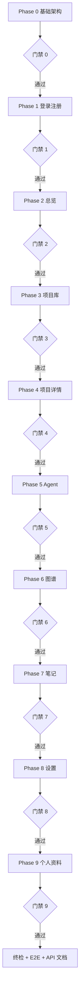

# RepoPilot v1 前端 Mock 开发流程

> 版本: 1.0.0 | 日期: 2026-07-05 | 状态: 执行中
> 权威来源: [FRONTEND_SPEC.md](../FRONTEND_SPEC.md) · [docs/product/v1](../../../product/v1/)
> 视觉参考: [docs/design/v1](../) HTML 原型
>
> **与 Monorepo 的关系：** 本流程在 **`docs/design/v1/frontend/`** 执行（Mock 优先）。`apps/web/` 为正式应用占位，**全部 Phase 审查通过后再迁入**。架构见 [`docs/architecture/OVERVIEW.md`](../../architecture/OVERVIEW.md)。

---

## 1. 开发策略

| 原则 | 说明 |
|------|------|
| Mock 优先 | `VITE_USE_MOCK=true`，所有数据来自 `MockApiClient` |
| 原型对齐 | 布局/样式以 `design-system.css` + 对应 `.html` 原型为准 |
| 规格对齐 | 类型、Store、路由以 `FRONTEND_SPEC.md` 为准；与 product/v1 冲突时以 **MVP_SCOPE §5.1**（本流程更新版）为准 |
| 分页门禁 | **每完成一个 Phase → 跑该 Phase 验收 → 通过后再开下一 Phase** |
| API 后置 | 前端全部通过审查后，从 `src/api/types.ts` + `MockApiClient` 导出后端接口文档 |

---

## 2. 页面与路由总览

| Phase | 文档 | 路由 | 侧栏 | 说明 |
|-------|------|------|------|------|
| 0 | [00-FOUNDATION.md](./00-FOUNDATION.md) | — | — | 骨架、设计系统、Mock 层、AppShell |
| 1 | [01-AUTH.md](./01-AUTH.md) | `/login` `/register` | 无 | 登录、注册 |
| 2 | [02-OVERVIEW.md](./02-OVERVIEW.md) | `/` | 总览 | 产品介绍、统计、GitHub 热门、快捷入口 |
| 3 | [03-PROJECTS.md](./03-PROJECTS.md) | `/projects` | 项目库 | 表格列表、筛选、**导入抽屉**（非独立页） |
| 4 | [04-PROJECT-DETAIL.md](./04-PROJECT-DETAIL.md) | `/projects/:id` | — | README、笔记 Tab、Scout 分析 |
| 5 | [05-AGENT.md](./05-AGENT.md) | `/agent` | Agent Chat | SSE 对话、反问、6 Agent |
| 6 | [06-GRAPH.md](./06-GRAPH.md) | `/graph` | 图谱 | D3 力导向图 |
| 7 | [07-NOTES.md](./07-NOTES.md) | `/notes` | 笔记 | 跨项目笔记管理 |
| 8 | [08-SETTINGS.md](./08-SETTINGS.md) | `/settings` | 设置 | 主题、字体、GitHub 绑定、LLM |
| 9 | [09-PROFILE.md](./09-PROFILE.md) | `/profile` | 无（Topbar 菜单） | 头像、改密、账号信息 |
| — | [10-REVIEW-GATES.md](./10-REVIEW-GATES.md) | — | — | 各 Phase 审查清单 + 终检 |
| — | [ROUTES-AND-NAV.md](./ROUTES-AND-NAV.md) | — | — | 路由/导航速查 |

### 关于「批量导入」

**不设独立页面。** 在项目库页通过两种 **Drawer / Modal** 完成（见 [03-PROJECTS.md](./03-PROJECTS.md)）：

1. **GitHub Star 导入抽屉** — 拉取 Star 列表、多选、确认导入
2. **URL 批量粘贴 Modal** — 每行一个 `https://github.com/owner/repo`，解析后导入

---

## 3. 推荐开发顺序（含门禁）



**并行说明：** Phase 4 依赖 Phase 3（项目数据）；Phase 7 可与 Phase 5/6 并行，但建议在 Agent 通过后再做，以便 Mock 数据稳定。

---

## 4. 全局规范（所有 Phase 适用）

### 4.1 技术栈

见 [FRONTEND_SPEC.md §1](../FRONTEND_SPEC.md)。禁止 Class Component、`any`、非空断言 `!`（实现时代码须遵守，文档示例仅供参考）。

### 4.2 目录

```
docs/design/v1/frontend/src/   # Mock 实施目录（下文简称 frontend/src）
├── api/types.ts          # 全部 API 类型（Mock/Real 共享）
├── api/client.ts         # getApi() + Mock 切换
├── api/mock/             # MockApiClient + data/
├── stores/               # Zustand
├── hooks/                # react-query 封装
├── pages/                # 每 Phase 对应页面
├── components/           # layout / common / 领域组件
└── styles/
    ├── design-system.css # 从原型迁移
    └── global.css
```

### 4.3 通用 UI 状态

每个数据页必须处理：

| 状态 | 组件 |
|------|------|
| 加载 | `LoadingSpinner` 或骨架屏 |
| 空 | `EmptyState` + 引导操作 |
| 错误 | `ErrorBanner` 或 Toast + 重试 |

### 4.4 `data-testid` 约定

E2E 用：`{page}-{element}`，例如 `projects-import-stars-btn`、`agent-chat-input`。

### 4.5 审查入口

每个 Phase 完成后，执行 [10-REVIEW-GATES.md](./10-REVIEW-GATES.md) 中对应 **Gate N**，再进入下一 Phase。

---

## 5. 与 product 文档的变更说明

本流程对 MVP 页面定义的更新（已写入 `MVP_SCOPE.md §5.1`）：

| 变更 | 理由 |
|------|------|
| `/` 改为 **总览页**（OverviewPage） | 对齐 HTML 原型 `overview.html` |
| `/projects` 为 **项目库**（ProjectsPage） | 与总览分离，表格+导入 |
| 新增 `/notes` | 对齐原型侧栏 |
| 新增 `/profile` | 账号信息与「应用设置」分离 |
| 批量导入为项目库内 Drawer/Modal | 避免多余路由，符合 MVP D-14 |

---

## 6. 完成后产出

1. 可运行的 Mock 前端（`npm run dev` / `npm run build`）
2. Vitest + Playwright 通过 [10-REVIEW-GATES.md](./10-REVIEW-GATES.md) 终检项
3. `docs/design/v1/API_CONTRACT.md`（开发完成后从代码生成，本流程不预先冻结）
