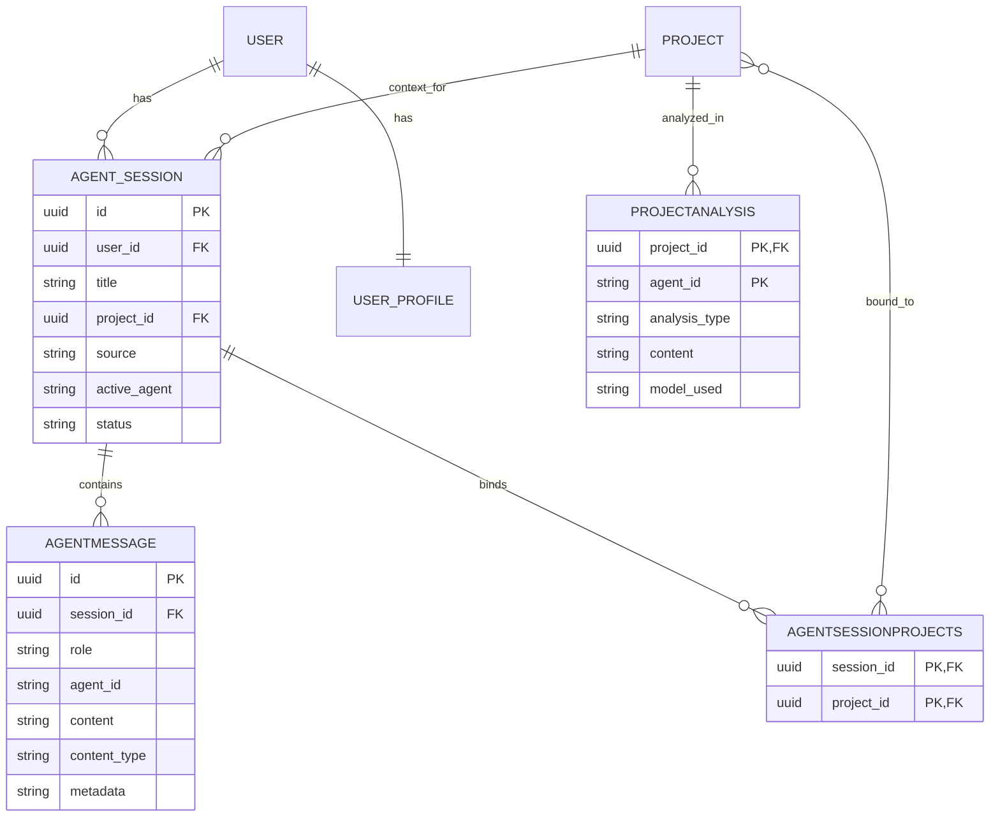

# 智能体系统数据模型

## AgentSession 实体

表示用户与 AI 智能体之间的对话会话。

### 模式

```python
class AgentSession(Base):
    __tablename__ = "agent_sessions"

    id: Mapped[uuid.UUID] = mapped_column(
        UUID(as_uuid=True), primary_key=True, default=uuid.uuid4
    )
    user_id: Mapped[uuid.UUID] = mapped_column(
        UUID(as_uuid=True), ForeignKey("users.id"), 
        nullable=False, index=True
    )
    title: Mapped[Optional[str]] = mapped_column(String(255), default="新对话")
    
    # Primary project (backward compatibility)
    project_id: Mapped[Optional[uuid.UUID]] = mapped_column(
        UUID(as_uuid=True), ForeignKey("projects.id"), 
        nullable=True, index=True
    )
    
    # Session metadata
    source: Mapped[Optional[str]] = mapped_column(String(16), default="chat")
    active_agent: Mapped[Optional[str]] = mapped_column(String(32), default="hub")
    status: Mapped[Optional[str]] = mapped_column(String(16), default="active")
    
    # Timestamps
    created_at: Mapped[datetime] = mapped_column(DateTime, default=datetime.utcnow)
    updated_at: Mapped[Optional[datetime]] = mapped_column(
        DateTime, onupdate=datetime.utcnow, nullable=True
    )
```

### 字段

| 字段 | 类型 | 说明 |
|-------|------|-------------|
| `id` | UUID | 主键 |
| `user_id` | UUID | 会话所有者（已建索引） |
| `title` | String(255) | 会话显示名称 |
| `project_id` | UUID | 主项目上下文（已建索引） |
| `source` | String(16) | 来源：`chat` 或 `analyze` |
| `active_agent` | String(32) | 当前活跃智能体 ID |
| `status` | String(16) | 会话状态：`active`、`paused`、`closed` |
| `created_at` | DateTime | 会话开始时间 |
| `updated_at` | DateTime | 最后活动时间 |

### 来源类型

| 来源 | 说明 |
|--------|-------------|
| `chat` | 用户发起的对话（默认） |
| `analyze` | 项目详情页 AI 分析 |

### 会话状态

| 状态 | 说明 |
|--------|-------------|
| `active` | 正常运行 |
| `paused` | 暂时不活跃 |
| `closed` | 由用户或系统结束 |

## AgentMessage 实体

智能体会话中的单条消息。

### 模式

```python
class AgentMessage(Base):
    __tablename__ = "agent_messages"

    id: Mapped[uuid.UUID] = mapped_column(
        UUID(as_uuid=True), primary_key=True, default=uuid.uuid4
    )
    session_id: Mapped[uuid.UUID] = mapped_column(
        UUID(as_uuid=True), ForeignKey("agent_sessions.id"), 
        nullable=False, index=True
    )
    role: Mapped[str] = mapped_column(String(16), nullable=False)
    agent_id: Mapped[Optional[str]] = mapped_column(String(32), nullable=True)
    content: Mapped[str] = mapped_column(Text, nullable=False)
    content_type: Mapped[Optional[str]] = mapped_column(String(16), default="text")
    message_meta: Mapped[Optional[str]] = mapped_column(
        "metadata", Text, default="{}"
    )
    created_at: Mapped[datetime] = mapped_column(DateTime, default=datetime.utcnow)
```

### 字段

| 字段 | 类型 | 说明 |
|-------|------|-------------|
| `id` | UUID | 主键 |
| `session_id` | UUID | 所属会话（已建索引） |
| `role` | String(16) | 消息角色：`user`、`assistant`、`system` |
| `agent_id` | String(32) | 智能体标识符（非外键——灵活设计） |
| `content` | Text | 消息内容 |
| `content_type` | String(16) | 格式：`text`、`markdown`、`tool_call` |
| `message_meta` | Text (JSON) | 附加元数据 |
| `created_at` | DateTime | 消息时间戳 |

### 消息角色

| 角色 | 说明 |
|------|-------------|
| `user` | 用户消息 |
| `assistant` | AI 智能体响应 |
| `system` | 系统消息（工具结果等） |

### 内容类型

| 类型 | 说明 |
|------|-------------|
| `text` | 纯文本（默认） |
| `markdown` | Markdown 格式 |
| `tool_call` | 工具调用 |
| `tool_result` | 工具执行结果 |

### 元数据结构

```json
{
  "thinking": "Agent's reasoning process",
  "tool_calls": [...],
  "tool_results": [...],
  "question": {
    "question_id": "q_123",
    "type": "choice",
    "items": [...]
  }
}
```

## AgentSessionCancelToken 实体

跨 Worker 的流取消信号。

### 模式

```python
class AgentSessionCancelToken(Base):
    __tablename__ = "agent_session_cancel_tokens"

    session_id: Mapped[uuid.UUID] = mapped_column(
        UUID(as_uuid=True),
        ForeignKey("agent_sessions.id", ondelete="CASCADE"),
        primary_key=True,
    )
    cancel_token: Mapped[str] = mapped_column(String(64), nullable=False)
    updated_at: Mapped[Optional[datetime]] = mapped_column(
        DateTime, onupdate=datetime.utcnow, 
        default=datetime.utcnow, nullable=True
    )
```

### 用途

支持跨多个 Worker 取消 SSE 流：
1. 流启动时，插入或更新令牌
2. 流循环定期检查令牌
3. 如果令牌与当前值不同，则终止流
4. 用户取消时生成新令牌

## ProjectAnalysis 实体

缓存的项目 AI 分析结果。

### 模式

```python
class ProjectAnalysis(Base):
    __tablename__ = "project_analyses"
    
    # Composite primary key: one analysis per project per agent
    project_id: Mapped[uuid.UUID] = mapped_column(
        UUID(as_uuid=True), ForeignKey("projects.id"), 
        primary_key=True
    )
    agent_id: Mapped[str] = mapped_column(String(32), primary_key=True)
    
    # Analysis content
    analysis_type: Mapped[str] = mapped_column(String(32), nullable=False)
    content: Mapped[str] = mapped_column(Text, nullable=False)
    
    # Metadata
    model_used: Mapped[Optional[str]] = mapped_column(String(64), nullable=True)
    tokens_used: Mapped[Optional[int]] = mapped_column(Integer, nullable=True)
    
    # Timestamps
    created_at: Mapped[datetime] = mapped_column(DateTime, default=datetime.utcnow)
    updated_at: Mapped[Optional[datetime]] = mapped_column(
        DateTime, onupdate=datetime.utcnow, nullable=True
    )
```

### 字段

| 字段 | 类型 | 说明 |
|-------|------|-------------|
| `project_id` | UUID | 项目（主键的一部分） |
| `agent_id` | String(32) | 执行分析的智能体（主键的一部分） |
| `analysis_type` | String(32) | 类型：`quick`、`deep`、`summary` |
| `content` | Text | 分析结果 |
| `model_used` | String(64) | LLM 模型标识符 |
| `tokens_used` | Integer | 令牌消耗量 |
| `created_at` | DateTime | 首次分析时间 |
| `updated_at` | DateTime | 最后更新时间 |

### 缓存策略

- 每个（项目，智能体）对仅保留一份分析
- 在显式刷新或模型变更时更新
- 可由用户主动失效

## 关联：agent_session_projects

多对多：会话可以引用多个项目。

```python
agent_session_projects = Table(
    "agent_session_projects",
    Base.metadata,
    Column(
        "session_id",
        UUID(as_uuid=True),
        ForeignKey("agent_sessions.id", ondelete="CASCADE"),
        primary_key=True,
    ),
    Column(
        "project_id",
        UUID(as_uuid=True),
        ForeignKey("projects.id", ondelete="CASCADE"),
        primary_key=True,
    ),
)
```

## 实体关系



## 使用模式

### 创建会话

```python
session = AgentSession(
    user_id=user_id,
    title="New Conversation",
    source="chat",
    active_agent="hub",
    status="active"
)
```

### 添加消息

```python
message = AgentMessage(
    session_id=session_id,
    role="assistant",
    agent_id="scout",
    content="Project analysis...",
    content_type="markdown",
    message_meta=json.dumps({"thinking": "..."})
)
```

### 查询会话历史

```python
messages = await session.execute(
    select(AgentMessage)
    .where(AgentMessage.session_id == session_id)
    .order_by(AgentMessage.created_at.asc())
)
```

### 取消流

```python
# Generate new cancel token
new_token = generate_token()
await session.execute(
    insert(AgentSessionCancelToken)
    .values(session_id=session_id, cancel_token=new_token)
    .on_conflict_do_update(
        index_elements=["session_id"],
        set_=dict(cancel_token=new_token)
    )
)
```