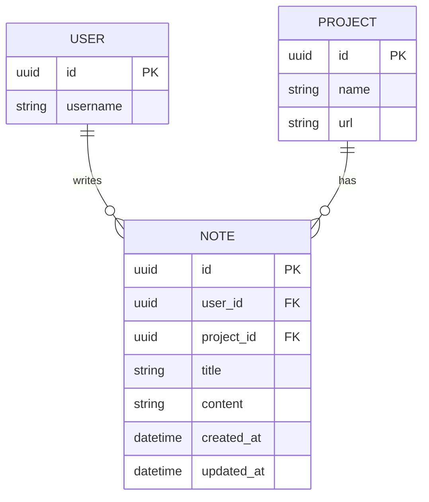

# 笔记数据模型

## Note 实体

与项目关联的学习笔记。笔记帮助用户在学习开源仓库时记录心得体会。

### Schema

```python
class Note(Base):
    __tablename__ = "notes"

    id: Mapped[uuid.UUID] = mapped_column(
        UUID(as_uuid=True), primary_key=True, default=uuid.uuid4
    )
    # §4.1.8: Notes indexed by user/project for dual-dimension queries
    user_id: Mapped[uuid.UUID] = mapped_column(
        UUID(as_uuid=True), ForeignKey("users.id"), 
        nullable=False, index=True
    )
    project_id: Mapped[uuid.UUID] = mapped_column(
        UUID(as_uuid=True), ForeignKey("projects.id"), 
        nullable=False, index=True
    )
    title: Mapped[str] = mapped_column(String(255), nullable=False)
    content: Mapped[Optional[str]] = mapped_column(Text, default="")
    created_at: Mapped[datetime] = mapped_column(DateTime, default=datetime.utcnow)
    updated_at: Mapped[Optional[datetime]] = mapped_column(
        DateTime, onupdate=datetime.utcnow, nullable=True
    )
```

### 字段

| 字段 | 类型 | 说明 |
|-------|------|-------------|
| `id` | UUID | 主键 |
| `user_id` | UUID | 笔记所有者（已建索引） |
| `project_id` | UUID | 关联项目（已建索引） |
| `title` | String(255) | 笔记标题 |
| `content` | Text | 笔记正文（Markdown） |
| `created_at` | DateTime | 创建时间戳 |
| `updated_at` | DateTime | 最后修改时间戳 |

## 实体关系



## 使用模式

### 创建笔记

```python
note = Note(
    user_id=user_id,
    project_id=project_id,
    title="Key Architecture Insights",
    content="## Module Structure\n\nThe project uses a layered architecture..."
)
session.add(note)
await session.commit()
```

### 查询项目笔记

```python
# All notes for a project
notes = await session.execute(
    select(Note)
    .where(Note.project_id == project_id)
    .where(Note.user_id == user_id)
    .order_by(Note.updated_at.desc())
)
```

### 搜索笔记

```python
# Search by title or content
notes = await session.execute(
    select(Note)
    .where(Note.user_id == user_id)
    .where(
        or_(
            Note.title.ilike(f"%{query}%"),
            Note.content.ilike(f"%{query}%")
        )
    )
)
```

### 更新笔记

```python
note = await session.get(Note, note_id)
note.title = "Updated Title"
note.content = "Updated content..."
await session.commit()
```

## 内容规范

笔记支持 Markdown 格式：

- 标题（`#`、`##`、`###`）
- 列表（`-`、`1.`）
- 代码块（```）
<!-- openwiki: broken internal link [url] file "url" does not exist. Fix the href or restore the target, then delete this comment. -->
- 链接（`[text](url)`）
- 强调（`*italic*`、`**bold**`）

## AI 生成的笔记

Scribe 智能体可以生成笔记：

1. **项目模式**：与用户库中的类似项目进行比较
2. **独立模式**：不进行比较的独立笔记

生成的笔记存储时具有以下特点：
- 标题根据内容自动生成
- 内容按标题结构化组织
- 关联到正在学习的项目

## 索引

| 索引 | 用途 |
|-------|---------|
| `ix_notes_user_id` | 快速查找用户笔记 |
| `ix_notes_project_id` | 快速查找项目笔记 |