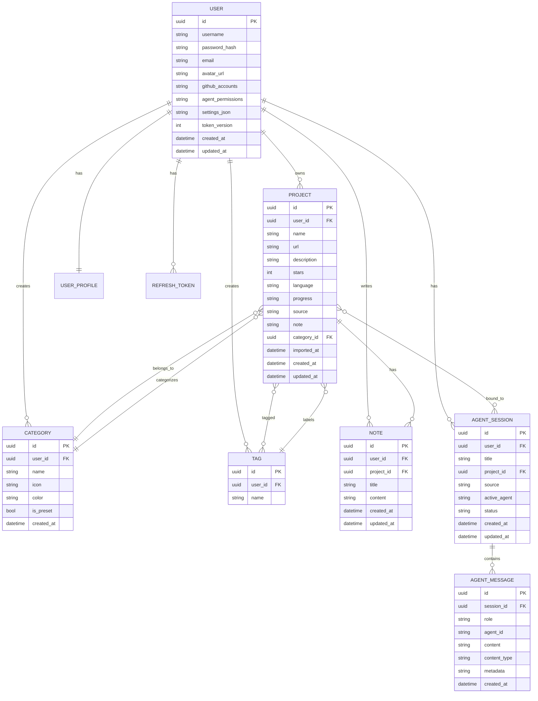

# 数据模型概览

## 实体概览

RepoPilot 使用 SQLAlchemy 2.0 ORM，包含以下核心实体：



## 实体分类

### 用户与认证
| 实体 | 描述 |
|--------|-------------|
| `User` | 核心用户账户 |
| `RefreshToken` | JWT 刷新令牌存储 |
| `UserProfile` | 供代理使用的扩展用户档案 |

### 项目管理
| 实体 | 描述 |
|--------|-------------|
| `Project` | GitHub 仓库或手动添加的条目 |
| `Category` | 项目分类 |
| `Tag` | 项目标签 |
| `project_tags` | 多对多关系 |

### 知识管理
| 实体 | 描述 |
|--------|-------------|
| `Note` | 关联到项目的学习笔记 |

### 代理系统
| 实体 | 描述 |
|--------|-------------|
| `AgentSession` | 代理对话会话 |
| `AgentMessage` | 会话中的单条消息 |
| `AgentSessionCancelToken` | 流式取消信号 |
| `ProjectAnalysis` | 缓存的项目 AI 分析 |
| `agent_session_projects` | 会话-项目绑定 |

## 关键设计决策

### 多租户

所有用户拥有的实体都包含 `user_id` 外键，并带有数据库索引以保证性能：

```python
class Project(Base):
    user_id: Mapped[uuid.UUID] = mapped_column(
        UUID(as_uuid=True), ForeignKey("users.id"), 
        nullable=False, index=True  # §4.1.8: user-scoped queries
    )
```

### 软关系

代理消息将代理 ID 存储为字符串（而非外键），以保持灵活性：

```python
class AgentMessage(Base):
    agent_id: Mapped[Optional[str]] = mapped_column(String(32), nullable=True)
    # Not a FK - allows dynamic agent registration
```

### JSON 字段

部分实体使用 JSON 文本字段以实现灵活的模式：

| 实体 | 字段 | 用途 |
|--------|-------|---------|
| `User` | `github_accounts` | 多 GitHub 账户存储 |
| `User` | `agent_permissions` | 按代理划分的权限设置 |
| `User` | `settings_json` | 用户偏好设置 |
| `UserProfile` | `tech_profile` | 技术技能档案 |
| `UserProfile` | `preferences` | 学习偏好 |
| `UserProfile` | `goals` | 学习目标 |
| `AgentMessage` | `message_meta` | 消息元数据 |

### 约束

| 约束 | 用途 |
|------------|---------|
| `uq_projects_user_url` | 防止同一用户添加重复项目 |
| `token_hash` 唯一约束 | 防止刷新令牌重用 |
| 密码 bcrypt 限制 | 强制执行 72 字节的 bcrypt 限制 |

## 数据库迁移

Alembic 迁移文件位于：

```
services/api/backend/migrations/alembic/versions/
```

### 关键迁移

| 迁移 | 描述 |
|-----------|-------------|
| `6096bed38e20_initial_schema.py` | 初始模式创建 |
| `9dd51a4a165a_add_refresh_tokens_last_used_at.py` | 令牌审计 |
| `e30c21e90eef_add_agent_session_cancel_tokens.py` | 流式取消 |
| `f4542a1f742b_add_fk_indexes.py` | 性能索引 |