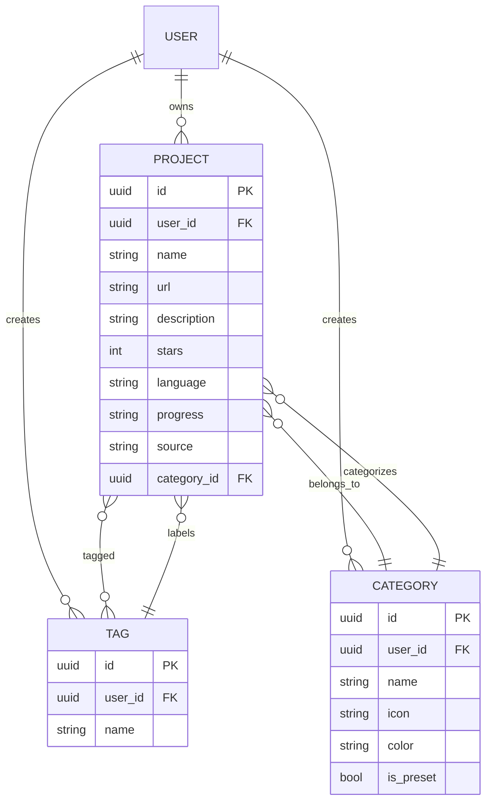

# 项目与标签数据模型

## Project 实体

`Project` 实体表示用户学习库中的 GitHub 仓库或手动添加的项目。

### 模式定义

```python
class Project(Base):
    __tablename__ = "projects"
    
    # Constraint: unique project per user by URL
    __table_args__ = (
        UniqueConstraint('user_id', 'url', name='uq_projects_user_url'),
    )

    id: Mapped[uuid.UUID] = mapped_column(
        UUID(as_uuid=True), primary_key=True, default=uuid.uuid4
    )
    user_id: Mapped[uuid.UUID] = mapped_column(
        UUID(as_uuid=True), ForeignKey("users.id"), 
        nullable=False, index=True
    )
    
    # Basic info
    name: Mapped[str] = mapped_column(String(255), nullable=False)
    url: Mapped[str] = mapped_column(String(512), nullable=False)
    description: Mapped[Optional[str]] = mapped_column(Text, nullable=True)
    
    # GitHub metadata
    stars: Mapped[int] = mapped_column(Integer, default=0)
    language: Mapped[Optional[str]] = mapped_column(String(64), nullable=True)
    
    # Learning state
    progress: Mapped[str] = mapped_column(String(16), default="none")
    source: Mapped[str] = mapped_column(String(16), default="manual")
    note: Mapped[Optional[str]] = mapped_column(Text, nullable=True)
    
    # Organization
    category_id: Mapped[Optional[uuid.UUID]] = mapped_column(
        UUID(as_uuid=True), ForeignKey("categories.id"), 
        nullable=True, index=True
    )
    
    # Timestamps
    imported_at: Mapped[datetime] = mapped_column(DateTime, default=datetime.utcnow)
    created_at: Mapped[datetime] = mapped_column(DateTime, default=datetime.utcnow)
    updated_at: Mapped[Optional[datetime]] = mapped_column(
        DateTime, onupdate=datetime.utcnow, nullable=True
    )
```

### 字段

| 字段 | 类型 | 描述 |
|-------|------|-------------|
| `id` | UUID | 主键 |
| `user_id` | UUID | 所有者（已建索引） |
| `name` | String(255) | 项目名称 |
| `url` | String(512) | 仓库 URL |
| `description` | Text | 项目描述 |
| `stars` | Integer | GitHub Star 数 |
| `language` | String(64) | 主要编程语言 |
| `progress` | String(16) | 学习进度：`none`、`learning`、`learned`、`mastered` |
| `source` | String(16) | 来源：`github`、`manual` |
| `note` | Text | 用户对项目的备注 |
| `category_id` | UUID | 指向 Category 的外键（已建索引） |
| `imported_at` | DateTime | 从 GitHub 导入的时间 |
| `created_at` | DateTime | 记录创建时间 |
| `updated_at` | DateTime | 最后更新时间 |

### 进度状态

| 状态 | 描述 |
|-------|-------------|
| `none` | 未开始（默认） |
| `learning` | 正在学习 |
| `learned` | 已达到基本理解 |
| `mastered` | 已深入掌握 |

### 来源类型

| 来源 | 描述 |
|--------|-------------|
| `github` | 从 GitHub 导入 |
| `manual` | 由用户手动添加 |

## Tag 实体

项目的标签，具有用户级别的命名空间。

### 模式定义

```python
class Tag(Base):
    __tablename__ = "tags"

    id: Mapped[uuid.UUID] = mapped_column(
        UUID(as_uuid=True), primary_key=True, default=uuid.uuid4
    )
    user_id: Mapped[uuid.UUID] = mapped_column(
        UUID(as_uuid=True), ForeignKey("users.id"), 
        nullable=False, index=True
    )
    name: Mapped[str] = mapped_column(String(64), nullable=False)
```

### 特征

- 用户级别：每个用户拥有自己的标签命名空间
- 结构简单：仅包含 `id`、`user_id`、`name`
- 通过 `project_tags` 关联表与项目建立多对多关系

## Category 实体

项目分类体系，包含预设分类和自定义分类。

### 模式定义

```python
class Category(Base):
    __tablename__ = "categories"

    id: Mapped[uuid.UUID] = mapped_column(
        UUID(as_uuid=True), primary_key=True, default=uuid.uuid4
    )
    user_id: Mapped[Optional[uuid.UUID]] = mapped_column(
        UUID(as_uuid=True), ForeignKey("users.id"), 
        nullable=True, index=True
    )
    name: Mapped[str] = mapped_column(String(64), nullable=False)
    icon: Mapped[Optional[str]] = mapped_column(String(32), nullable=True)
    color: Mapped[Optional[str]] = mapped_column(String(16), nullable=True)
    is_preset: Mapped[bool] = mapped_column(Boolean, default=False)
    created_at: Mapped[datetime] = mapped_column(DateTime, default=datetime.utcnow)
```

### 字段

| 字段 | 类型 | 描述 |
|-------|------|-------------|
| `id` | UUID | 主键 |
| `user_id` | UUID | 所有者（预设分类为 null） |
| `name` | String(64) | 分类名称 |
| `icon` | String(32) | 图标标识符 |
| `color` | String(16) | 颜色代码（十六进制） |
| `is_preset` | Boolean | 系统预设分类 |
| `created_at` | DateTime | 创建时间 |

### 分类类型

| 类型 | 描述 |
|------|-------------|
| 预设 | 系统定义（`is_preset=true`，`user_id=null`） |
| 自定义 | 用户定义（`is_preset=false`，`user_id=所有者`） |

### 预设分类

数据库初始化时播种的分类：

- 前端
- 后端
- AI/ML
- DevOps
- 移动端
- 数据库
- 工具
- 学习

## 关联：project_tags

项目与标签之间的多对多关系。

```python
project_tags = Table(
    "project_tags",
    Base.metadata,
    Column("project_id", UUID(as_uuid=True), ForeignKey("projects.id"), primary_key=True),
    Column("tag_id", UUID(as_uuid=True), ForeignKey("tags.id"), primary_key=True),
)
```

## 实体关系



## 使用模式

### 按用户查询项目

```python
# All projects owned by user
projects = await session.execute(
    select(Project).where(Project.user_id == user_id)
)
```

### 带过滤条件查询

```python
# Filter by category and progress
projects = await session.execute(
    select(Project)
    .where(Project.user_id == user_id)
    .where(Project.category_id == category_id)
    .where(Project.progress == "learning")
)
```

### 搜索项目

```python
# Text search in name and description
projects = await session.execute(
    select(Project)
    .where(Project.user_id == user_id)
    .where(
        or_(
            Project.name.ilike(f"%{query}%"),
            Project.description.ilike(f"%{query}%")
        )
    )
)
```

### 获取带标签的项目

```python
# Eager load tags
projects = await session.execute(
    select(Project)
    .where(Project.user_id == user_id)
    .options(selectinload(Project.tags))
)
```

## 约束与索引

| 索引/约束 | 用途 |
|------------------|---------|
| `uq_projects_user_url` | 防止同一用户出现重复项目 |
| `ix_projects_user_id` | 快速执行用户级别的查询 |
| `ix_projects_category_id` | 快速按分类过滤 |
| `ix_tags_user_id` | 快速查找用户标签 |
| `ix_categories_user_id` | 快速查找用户分类 |