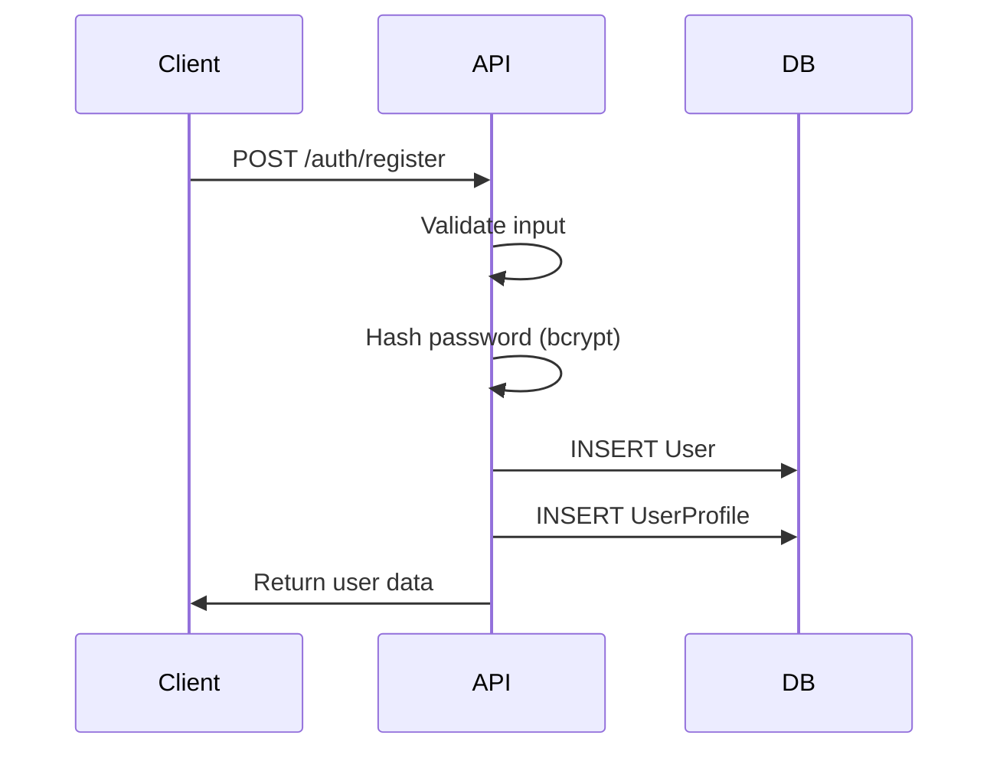
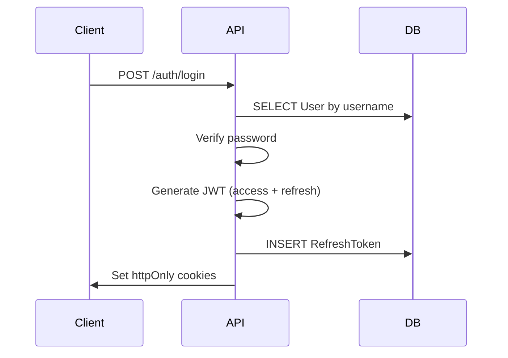
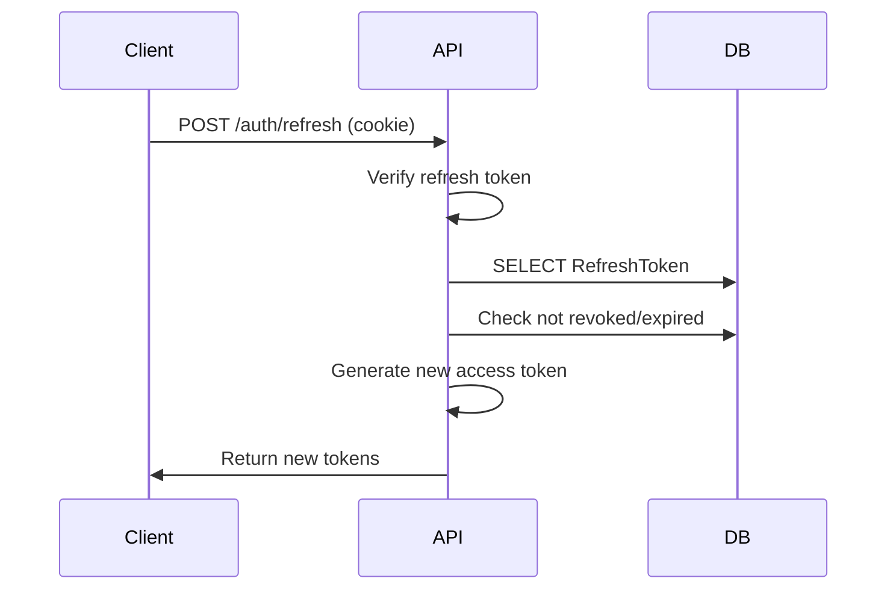

# 用户与认证数据模型

## User 实体

`User` 实体是 RepoPilot 中的核心身份标识。

### 模式定义

```python
class User(Base):
    __tablename__ = "users"

    id: Mapped[uuid.UUID] = mapped_column(
        UUID(as_uuid=True), primary_key=True, default=uuid.uuid4
    )
    username: Mapped[str] = mapped_column(
        String(32), unique=True, index=True, nullable=False
    )
    password_hash: Mapped[str] = mapped_column(String(255), nullable=False)
    email: Mapped[Optional[str]] = mapped_column(String(255), nullable=True)
    avatar_url: Mapped[Optional[str]] = mapped_column(String(512), nullable=True)
    
    # JSON fields for extensibility
    github_accounts: Mapped[str] = mapped_column(Text, default="[]")
    agent_permissions: Mapped[str] = mapped_column(String(1024), default="{}")
    settings_json: Mapped[str] = mapped_column(Text, default="{}")
    
    # Security
    token_version: Mapped[int] = mapped_column(
        Integer, default=0, server_default="0", nullable=False
    )
    
    # Timestamps
    created_at: Mapped[datetime] = mapped_column(DateTime, default=datetime.utcnow)
    updated_at: Mapped[Optional[datetime]] = mapped_column(
        DateTime, onupdate=datetime.utcnow, nullable=True
    )
```

### 字段说明

| 字段 | 类型 | 描述 |
|-------|------|-------------|
| `id` | UUID | 主键 |
| `username` | String(32) | 唯一用户名，带索引 |
| `password_hash` | String(255) | 使用 bcrypt 哈希的密码 |
| `email` | String(255) | 可选的电子邮件地址 |
| `avatar_url` | String(512) | 个人资料头像 URL（仅限 GitHub） |
| `github_accounts` | Text (JSON) | 关联的 GitHub 账户 |
| `agent_permissions` | String(1024) (JSON) | 针对每个 Agent 的权限 |
| `settings_json` | Text (JSON) | 用户偏好设置 |
| `token_version` | Integer | JWT 失效计数器 |
| `created_at` | DateTime | 账户创建时间 |
| `updated_at` | DateTime | 最后更新时间 |

### 关系

```
User ||--o{ Project : owns
User ||--o{ Category : creates
User ||--o{ Tag : creates
User ||--o{ Note : writes
User ||--o{ AgentSession : has
User ||--o{ RefreshToken : has
User ||--|| UserProfile : has
```

## RefreshToken 实体

存储用于会话管理的 JWT 刷新令牌。

### 模式定义

```python
class RefreshToken(Base):
    __tablename__ = "refresh_tokens"

    id: Mapped[uuid.UUID] = mapped_column(
        UUID(as_uuid=True), primary_key=True, default=uuid.uuid4
    )
    user_id: Mapped[uuid.UUID] = mapped_column(
        UUID(as_uuid=True), ForeignKey("users.id"), 
        nullable=False, index=True
    )
    token_hash: Mapped[str] = mapped_column(
        String(64), unique=True, nullable=False, index=True
    )
    expires_at: Mapped[datetime] = mapped_column(DateTime, nullable=False)
    revoked: Mapped[bool] = mapped_column(Boolean, default=False)
    created_at: Mapped[datetime] = mapped_column(DateTime, default=datetime.utcnow)
    last_used_at: Mapped[Optional[datetime]] = mapped_column(DateTime, nullable=True)
```

### 安全特性

1. **令牌哈希**：仅存储 SHA-256 哈希值，不存储实际令牌
2. **过期时间**：令牌有效期为 7 天
3. **吊销机制**：可吊销令牌（登出、安全事件时）
4. **审计追踪**：`last_used_at` 记录使用情况
5. **唯一约束**：防止令牌重复

## UserProfile 实体

用于 AI Agent 个性化的扩展用户资料。

### 模式定义

```python
class UserProfile(Base):
    __tablename__ = "user_profiles"

    user_id: Mapped[uuid.UUID] = mapped_column(
        UUID(as_uuid=True), ForeignKey("users.id"), primary_key=True
    )
    
    # Technical profile (JSON)
    tech_profile: Mapped[Optional[str]] = mapped_column(Text, default="{}")
    
    # Learning preferences (JSON)
    preferences: Mapped[Optional[str]] = mapped_column(Text, default="{}")
    
    # Learning goals (JSON array)
    goals: Mapped[Optional[str]] = mapped_column(Text, default="[]")
    
    # Historical summary
    history_summary: Mapped[Optional[str]] = mapped_column(Text, default="")
    
    # Agent-specific preferences
    agent_prefs: Mapped[Optional[str]] = mapped_column(Text, default="{}")
    
    updated_at: Mapped[Optional[datetime]] = mapped_column(
        DateTime, onupdate=datetime.utcnow, nullable=True
    )
```

### JSON 结构示例

**tech_profile**：
```json
{
  "languages": ["Python", "JavaScript", "Go"],
  "frameworks": ["FastAPI", "React", "Django"],
  "level": "intermediate",
  "experience_years": 3,
  "interests": ["AI", "Web Development", "Open Source"]
}
```

**preferences**：
```json
{
  "learning_style": "hands_on",
  "content_depth": "detailed",
  "agent_speaking_style": "gentle",
  "preferred_language": "zh",
  "notification_enabled": true
}
```

**goals**：
```json
[
  {
    "id": "goal_1",
    "title": "Master React 19",
    "status": "in_progress",
    "target_date": "2026-12-31"
  }
]
```

## 认证流程

### 注册



### 登录



### 令牌刷新



## 安全注意事项

### 密码安全

- **哈希算法**：使用加盐的 bcrypt
- **长度限制**：72 字节（强制执行 bcrypt 限制）
- **复杂度要求**：最少 8 个字符
- **存储方式**：绝不存储明文密码

### JWT 安全

- **签名方式**：使用 32 字节以上密钥的 HS256
- **访问令牌有效期**：15 分钟
- **刷新令牌有效期**：7 天
- **令牌版本**：密码修改时递增，使所有现有令牌失效

### Cookie 安全

```python
# Cookie settings
response.set_cookie(
    key="access_token",
    value=access_token,
    httponly=True,
    secure=True,        # HTTPS only in production
    samesite="strict",
    max_age=900,        # 15 minutes
)
```

### 速率限制

| 端点 | 限制 |
|----------|-------|
| `/auth/login` | 5 次/分钟 |
| `/auth/register` | 3 次/分钟 |
| `/auth/refresh` | 10 次/分钟 |