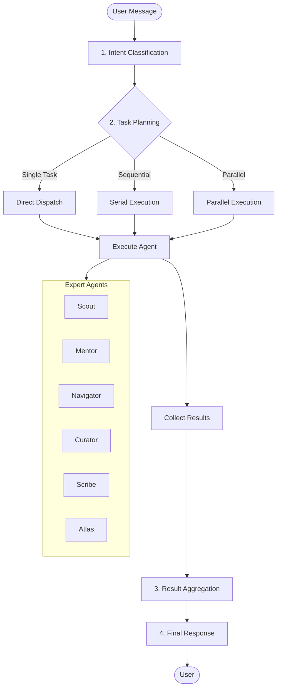
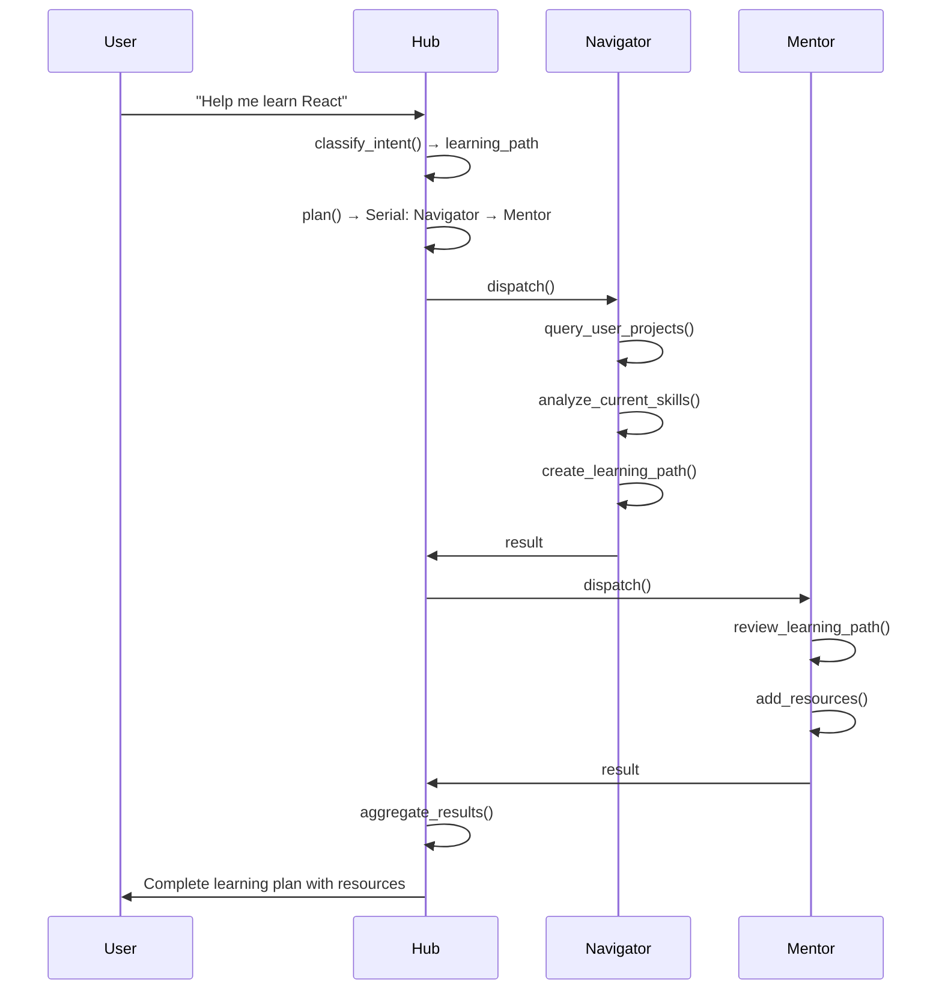
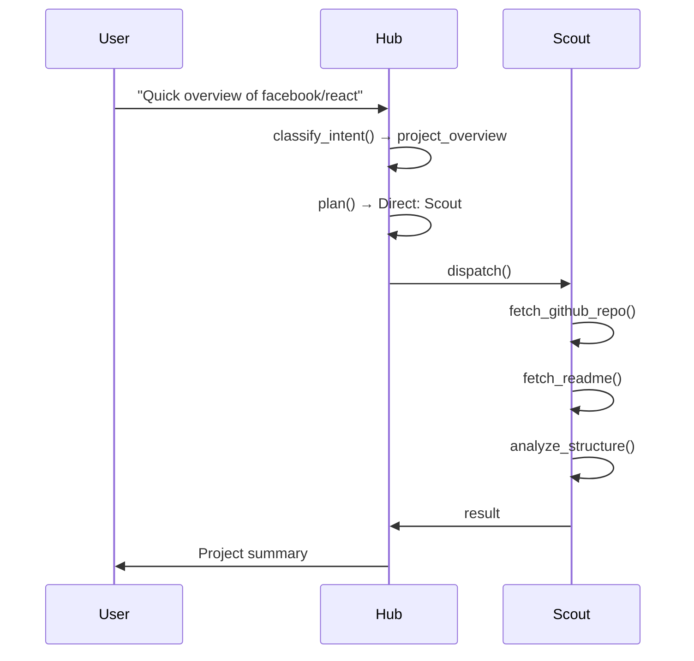
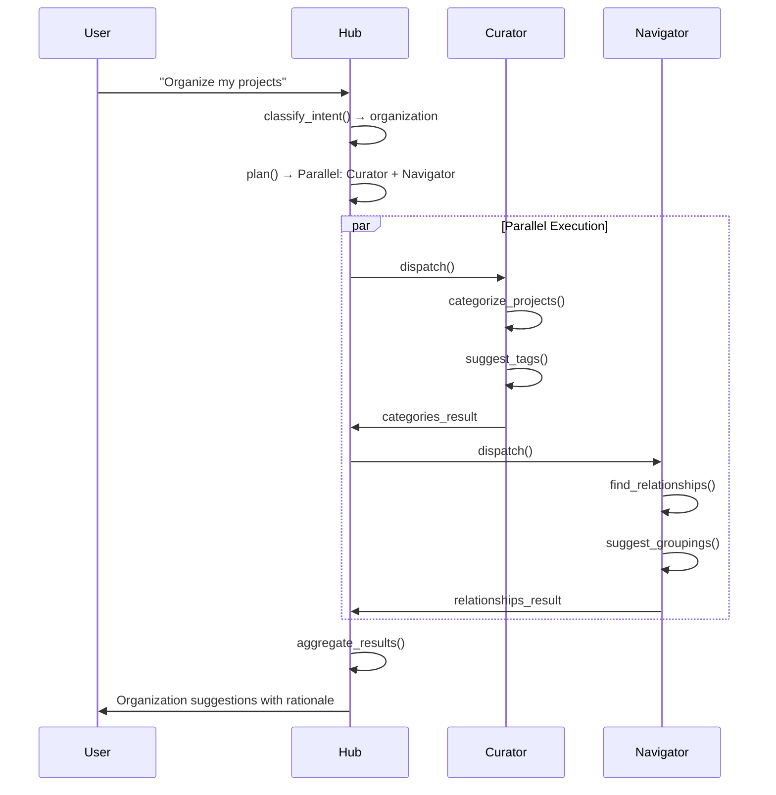

# 智能体编排工作流

## 概述

Hub 智能体通过理解用户意图、规划任务、调度专家智能体并聚合结果来编排多智能体系统。

## 编排流程



## 分步流程

### 1. 意图分类

```python
class IntentClassifier:
    INTENTS = [
        "project_overview",      # Quick project summary
        "deep_analysis",         # Detailed analysis
        "learning_path",         # Create learning plan
        "organization",          # Categorize/tag projects
        "note_taking",           # Generate notes
        "graph_exploration",     # Knowledge graph queries
        "general_chat",          # Casual conversation
    ]
    
    async def classify(self, message: str, context: Context) -> IntentResult:
        # Use LLM to classify intent
        prompt = f"""
        User message: {message}
        Available projects: {context.projects}
        
        Classify intent into one of: {self.INTENTS}
        """
        return await self.llm.classify(prompt)
```

**意图到智能体的映射：**

| 意图 | 主智能体 | 辅助智能体 |
|--------|--------------|-----------|
| `project_overview` | Scout | - |
| `deep_analysis` | Mentor | Scout |
| `learning_path` | Navigator | Mentor |
| `organization` | Curator | - |
| `note_taking` | Scribe | Mentor |
| `graph_exploration` | Atlas | Navigator |
| `general_chat` | Hub | - |

### 2. 任务规划

```python
class TaskPlanner:
    async def plan(self, intent: IntentResult, context: Context) -> ExecutionPlan:
        if intent.is_single_task:
            return DirectDispatch(agent=intent.primary_agent)
        
        if intent.has_dependencies:
            return SerialExecution([
                Task(agent="scout", depends_on=[]),
                Task(agent="mentor", depends_on=["scout"]),
            ])
        
        return ParallelExecution([
            Task(agent="scout"),
            Task(agent="navigator"),
        ])
```

### 3. 智能体调度

#### 直接调度（单智能体）

```python
async def direct_dispatch(agent_id: str, task: Task, context: Context):
    # Stream: subagent_start event
    yield StreamEvent("subagent_start", {"target": agent_id})
    
    # Execute agent
    agent = get_agent(agent_id)
    result = await agent.run(task, context)
    
    # Stream: subagent_end event
    yield StreamEvent("subagent_end", {"target": agent_id, "summary": result.summary})
    
    return result
```

#### 串行执行

```python
async def serial_execution(tasks: list[Task], context: Context):
    results = []
    accumulated_context = context
    
    for task in tasks:
        # Each task gets context from previous results
        result = await execute_agent(task.agent, task, accumulated_context)
        results.append(result)
        
        # Accumulate context
        accumulated_context.add_result(result)
        
        # Stream progress
        yield StreamEvent("progress", {"completed": len(results), "total": len(tasks)})
    
    return results
```

#### 并行执行

```python
async def parallel_execution(tasks: list[Task], context: Context):
    # Execute all agents concurrently
    tasks_coros = [
        execute_agent(task.agent, task, context)
        for task in tasks
    ]
    
    results = await asyncio.gather(*tasks_coros)
    
    return results
```

### 4. 结果聚合

```python
class ResultAggregator:
    async def aggregate(self, results: list[AgentResult], original_query: str) -> str:
        if len(results) == 1:
            return results[0].content
        
        # Multi-agent summary
        summaries = [
            structure_expert_summary(r.agent_id, r.content)
            for r in results
        ]
        
        prompt = f"""
        Original user query: {original_query}
        
        Expert outputs:
        {'\n\n'.join(summaries)}
        
        Provide a coherent response synthesizing these expert opinions.
        """
        
        return await self.llm.complete(prompt)
```

## 示例工作流

### 工作流：“帮我学习 React”



### 工作流：“快速概览 facebook/react”



### 工作流：“整理我的项目”



## 智能体切换

### 切换事件

当智能体被调度时，Hub 会发送切换事件：

```python
async def dispatch_agent(target: str, reason: str, task: Task):
    # Notify client of switch
    yield StreamEvent("switch", {
        "target_agent": target,
        "reason": reason
    })
    
    # Execute
    agent = get_agent(target)
    async for event in agent.run(task):
        yield event
```

### 客户端处理

```typescript
// Frontend receives switch event
function handleSwitch(event: SwitchEvent) {
  // Update UI to show active agent
  setActiveAgent(event.target_agent);
  
  // Show reason for switch
  showAgentSwitchReason(event.reason);
  
  // Maybe show typing indicator
  showTypingIndicator(event.target_agent);
}
```

## 记忆集成

### 短期记忆（会话）

```python
class ContextBuilder:
    def build(self, session: AgentSession) -> Context:
        # Recent messages (last N)
        recent_messages = session.messages[-10:]
        
        # Current task context
        task_context = {
            "active_agent": session.active_agent,
            "bound_projects": session.projects,
        }
        
        return Context(
            messages=recent_messages,
            task=task_context,
        )
```

### 长期记忆（用户画像）

```python
async def enrich_with_memory(context: Context, user_id: UUID):
    profile = await memory_service.get_profile(user_id)
    
    context.user_skills = profile.tech_profile
    context.preferences = profile.preferences
    context.learning_history = profile.history_summary
```

## 错误处理

| 场景 | 处理方式 |
|----------|--------|
| 智能体超时 | 重试一次，然后回退到 Hub |
| 智能体出错 | 记录错误，继续执行其他智能体 |
| 所有智能体均失败 | Hub 提供通用响应 |
| 无效的工具调用 | 修正后重试 |
| 速率限制 | 排队并以退避策略重试 |