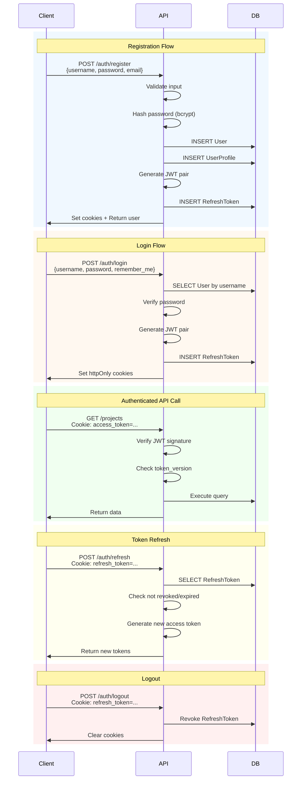

# 认证工作流

## 概述

RepoPilot 使用基于 JWT 的认证机制，并采用刷新令牌轮换，以实现安全、无状态的会话。

## 流程图



## 注册

### 请求校验

1. **用户名**：3-32 个字符，且必须唯一
2. **密码**：8-72 字节（bcrypt 的限制）
3. **邮箱**：可选，须为有效格式

### 处理流程

```python
async def register(data: UserCreate):
    # 1. Check username uniqueness
    if await user_exists(data.username):
        raise HTTPException(400, "Username taken")
    
    # 2. Hash password
    password_hash = bcrypt.hash(data.password)
    
    # 3. Create user
    user = User(
        username=data.username,
        password_hash=password_hash,
        email=data.email
    )
    
    # 4. Create profile
    profile = UserProfile(user_id=user.id)
    
    # 5. Generate tokens
    access_token, refresh_token = generate_jwt_pair(user)
    
    # 6. Store refresh token
    await store_refresh_token(user.id, refresh_token)
    
    # 7. Return with cookies
    return TokenOut(user=user), set_auth_cookies(access_token, refresh_token)
```

## 登录

### 处理流程

```python
async def login(data: UserLogin):
    # 1. Find user
    user = await get_user_by_username(data.username)
    if not user:
        raise HTTPException(401, "Invalid credentials")
    
    # 2. Verify password
    if not bcrypt.verify(data.password, user.password_hash):
        raise HTTPException(401, "Invalid credentials")
    
    # 3. Generate tokens
    access_token, refresh_token = generate_jwt_pair(user)
    
    # 4. Store refresh token (with longer expiry if remember_me)
    expires = timedelta(days=30 if data.remember_me else 7)
    await store_refresh_token(user.id, refresh_token, expires)
    
    # 5. Set cookies
    return set_auth_cookies(access_token, refresh_token)
```

### Cookie 设置

```python
response.set_cookie(
    key="access_token",
    value=access_token,
    httponly=True,
    secure=settings.cookie_secure,  # True in production
    samesite="strict",
    max_age=900,  # 15 minutes
)

response.set_cookie(
    key="refresh_token",
    value=refresh_token,
    httponly=True,
    secure=settings.cookie_secure,
    samesite="strict",
    max_age=604800,  # 7 days (or 30 days if remember_me)
)
```

## 令牌验证

### 访问令牌校验

```python
async def get_current_user(request: Request):
    # 1. Extract token from cookie or header
    token = get_token_from_request(request)
    
    # 2. Verify signature
    payload = jwt.decode(token, settings.secret_key, algorithms=["HS256"])
    
    # 3. Check expiration
    if payload["exp"] < datetime.utcnow():
        raise HTTPException(401, "Token expired")
    
    # 4. Get user
    user = await get_user(payload["sub"])
    
    # 5. Verify token version (password change invalidation)
    if payload.get("version") != user.token_version:
        raise HTTPException(401, "Token revoked")
    
    return user
```

## 令牌刷新

### 处理流程

```python
async def refresh(request: Request):
    # 1. Get refresh token from cookie or body
    refresh_token = get_refresh_token(request)
    
    # 2. Hash and lookup
    token_hash = sha256(refresh_token.encode()).hexdigest()
    stored = await get_refresh_token_by_hash(token_hash)
    
    # 3. Validate
    if not stored or stored.revoked or stored.expires_at < datetime.utcnow():
        raise HTTPException(401, "Invalid refresh token")
    
    # 4. Update last_used_at
    stored.last_used_at = datetime.utcnow()
    
    # 5. Get user
    user = await get_user(stored.user_id)
    
    # 6. Generate new access token (refresh token rotation optional)
    access_token, new_refresh = generate_jwt_pair(user)
    
    # 7. Revoke old, store new
    stored.revoked = True
    await store_refresh_token(user.id, new_refresh)
    
    return set_auth_cookies(access_token, new_refresh)
```

## 登出

### 处理流程

```python
async def logout(request: Request):
    # 1. Get refresh token
    refresh_token = get_refresh_token(request)
    
    if refresh_token:
        # 2. Revoke in database
        token_hash = sha256(refresh_token.encode()).hexdigest()
        await revoke_refresh_token(token_hash)
    
    # 3. Clear cookies
    response.delete_cookie("access_token")
    response.delete_cookie("refresh_token")
```

## 安全特性

| 特性 | 实现方式 |
|---------|----------------|
| 密码哈希 | 带盐的 bcrypt |
| 令牌签名 | 使用 32 字节以上密钥的 HS256 |
| Cookie 安全 | httpOnly、secure、sameSite=strict |
| 令牌轮换 | 刷新令牌在使用时轮换 |
| 版本失效 | 修改密码会使所有令牌失效 |
| 速率限制 | 登录：5 次/分钟，注册：3 次/分钟 |
| CSRF 防护 | Origin/Referer 校验 |

## 错误码

| 错误码 | HTTP 状态码 | 描述 |
|------|------|-------------|
| `INVALID_CREDENTIALS` | 401 | 用户名或密码错误 |
| `USERNAME_TAKEN` | 400 | 用户名已存在 |
| `TOKEN_EXPIRED` | 401 | 访问令牌已过期 |
| `TOKEN_REVOKED` | 401 | 令牌已失效（密码已修改） |
| `INVALID_REFRESH_TOKEN` | 401 | 刷新令牌无效或已过期 |
| `RATE_LIMITED` | 429 | 尝试次数过多 |