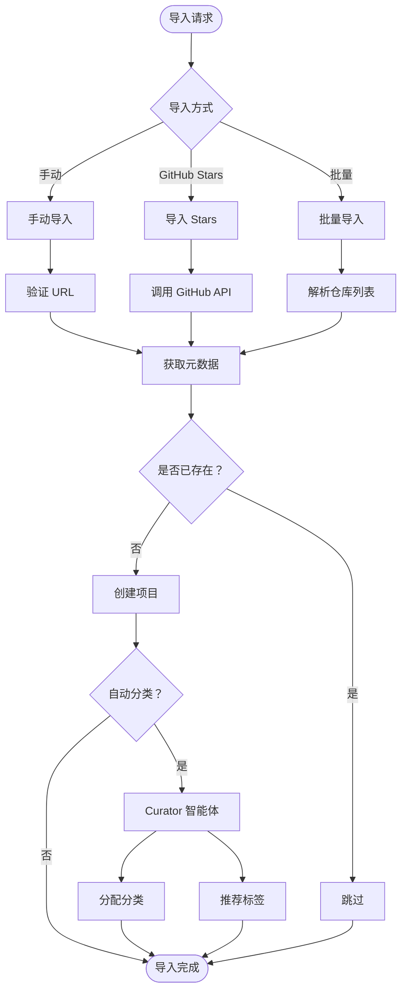
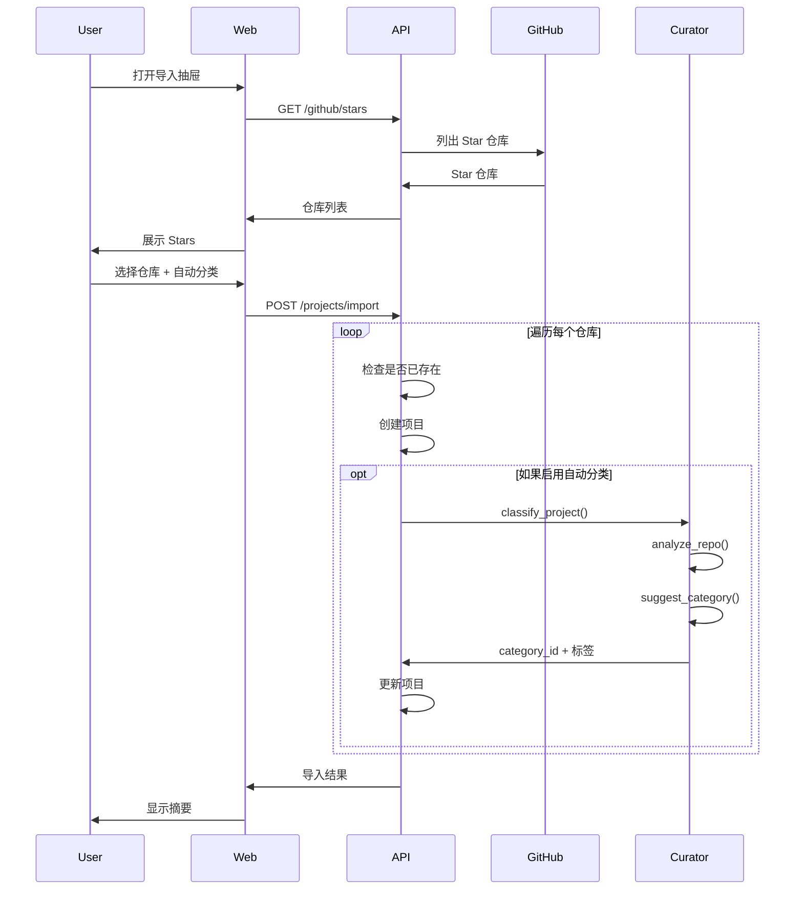

# 项目导入工作流

## 概述

项目可以通过多种来源导入 RepoPilot：手动输入 URL、GitHub Star 仓库，或带 AI 辅助分类的批量导入。

## 导入方式



## 1. 手动导入

### API 端点

```
POST /api/v1/projects
```

### 请求

```json
{
  "name": "react",
  "url": "https://github.com/facebook/react",
  "description": "A declarative, efficient, and flexible JavaScript library...",
  "source": "manual",
  "category_id": "optional-uuid",
  "tags": ["frontend", "javascript"],
  "progress": "none"
}
```

### 处理流程

```python
async def create_project(data: ProjectCreate, user: User):
    # 1. 验证 URL
    if not is_valid_github_url(data.url):
        raise HTTPException(400, "Invalid GitHub URL")
    
    # 2. 检查重复
    if await project_exists(user.id, data.url):
        raise HTTPException(409, "Project already exists")
    
    # 3. 获取 GitHub 元数据（可选增强）
    if data.source == "github":
        metadata = await fetch_github_metadata(data.url)
        data.stars = metadata.stars
        data.language = metadata.language
    
    # 4. 创建项目
    project = Project(
        user_id=user.id,
        name=data.name,
        url=data.url,
        # ... 其他字段
    )
    
    # 5. 处理标签
    for tag_name in data.tags:
        tag = await get_or_create_tag(user.id, tag_name)
        project.tags.append(tag)
    
    await db.commit()
    return project
```

## 2. 从 GitHub Stars 导入

### API 端点

```
GET /api/v1/github/stars
POST /api/v1/projects/import
```

### 流程



### 导入请求

```json
{
  "repos": [
    {"owner": "facebook", "repo": "react"},
    {"owner": "vuejs", "repo": "vue"}
  ],
  "auto_categorize": true
}
```

### 响应

```json
{
  "code": 0,
  "data": {
    "imported": 10,
    "skipped": 2,
    "failed": 0,
    "details": [
      {"name": "react", "status": "imported", "category": "Frontend"},
      {"name": "vue", "status": "imported", "category": "Frontend"},
      {"name": "django", "status": "skipped", "reason": "already_exists"}
    ]
  }
}
```

## 3. AI 辅助分类

### Curator 智能体工作流

```python
async def classify_project(project: Project, user: User):
    # 1. 收集上下文
    context = {
        "project_name": project.name,
        "description": project.description,
        "language": project.language,
        "user_categories": await get_user_categories(user.id),
        "existing_projects": await get_sample_projects(user.id),
    }
    
    # 2. 智能体分析（Reflexion 工作流）
    curator = get_agent("curator")
    result = await curator.run(
        task="classify_project",
        context=context
    )
    
    # 3. 应用结果
    if result.category_id:
        project.category_id = result.category_id
    
    for tag_name in result.suggested_tags:
        tag = await get_or_create_tag(user.id, tag_name)
        project.tags.append(tag)
    
    return project
```

### 分类类别

| 分类 | 描述 | 示例 |
|----------|-------------|----------|
| 前端 | UI/客户端 | React、Vue、Angular |
| 后端 | 服务端 | Django、Express、Spring |
| AI/ML | 机器学习 | PyTorch、TensorFlow |
| DevOps | 基础设施 | Docker、Kubernetes |
| 移动端 | 移动应用 | React Native、Flutter |
| 数据库 | 数据存储 | PostgreSQL、MongoDB |
| 工具 | 开发工具 | ESLint、Prettier |
| 学习 | 教育类 | 算法仓库 |

### Reflexion 流程

```
步骤 1：候选生成
  → 提出 2-3 个可能的分类

步骤 2：评估
  → 与现有分类进行比对
  → 避免重复
  → 防止命名过于具体

步骤 3：反思（最多 2 轮）
  → “这个分类是否与现有分类过于相似？”
  → “这个名称对用户来说是否有意义？”

步骤 4：最终决策
  → 选择最佳分类或创建新分类
  → 推荐相关标签
```

## 重复检测

### 按 URL 检测

```python
async def project_exists(user_id: UUID, url: str) -> bool:
    normalized = normalize_github_url(url)
    result = await session.execute(
        select(Project).where(
            Project.user_id == user_id,
            Project.url == normalized
        )
    )
    return result.scalar_one_or_none() is not None
```

### URL 规范化

- 移除 `.git` 后缀
- 将 `http` 规范化为 `https`
- 移除末尾斜杠
- 标准化大小写（owner/repo）

## 进度跟踪

导入过程中，进度可以流式推送到客户端：

```
event: progress
data: {"current": 5, "total": 20, "status": "importing facebook/react"}

event: progress
data: {"current": 6, "total": 20, "status": "categorizing vuejs/vue"}
```

## 错误处理

| 错误 | 原因 | 处理方式 |
|-------|-------|--------|
| `INVALID_URL` | URL 不是 GitHub 地址 | 跳过并通知 |
| `REPO_NOT_FOUND` | 私有/已删除 | 跳过并记录日志 |
| `RATE_LIMITED` | GitHub API 限流 | 退避重试 |
| `ALREADY_EXISTS` | 重复 | 跳过 |
| `CATEGORIZATION_FAILED` | AI 错误 | 不带分类导入 |

## 批量大小限制

| 限制项 | 值 |
|-------|-------|
| 每次导入的最大仓库数 | 100 |
| 最大并发 AI 调用数 | 5 |
| GitHub API 每页数量 | 100 |
| 获取的 Stars 总数 | 1000 |